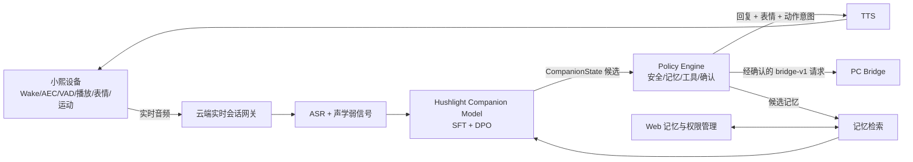

# 小熙 Hushlight 情感引擎训练方案

> 文档版本：V0.1  
> 更新日期：2026-08-14  
> 状态：专项设计基线；1A/2C/3A/4B 已决策，具体模型版本与成本待 O-006  
> 上游依据：[01_prd.md](../../docs/01_prd.md)、[03_architecture.md](../../docs/03_architecture.md)、[07_decisions.md](../../docs/07_decisions.md)  
> 配套文档：[16_companion_state_schema.md](16_companion_state_schema.md)、[17_ai_model_evaluation_protocol.md](17_ai_model_evaluation_protocol.md)、[18_ai_dataset_license_registry.md](18_ai_dataset_license_registry.md)

## 1. 结论与边界

Hushlight 的核心情感能力不能只依赖厂商原版模型和系统提示词。项目需要持续建设自有的情感交互数据、偏好数据、评测集和可迁移训练流程，并以 SFT 与 DPO 为首选训练路线。

本结论不冻结具体基座、云厂商、ASR、TTS、GPU 或训练平台。以下项目仍由 O-006 管理：

- 主力 Companion Model 的基座与版本；
- Teacher、Judge 和 Fallback 模型；
- 自部署或托管部署；
- ASR、声学情感、TTS 和实时会话供应商；
- 训练、推理、存储和语音的单位成本；
- 故障切换、限额和模型升级策略。

设备端不运行通用 LLM。设备负责本地唤醒、音频前处理、播放、动画、端侧目标位置和运动闭环；云端负责语义推理、关系与偏好记忆、策略和模型路由；Bridge 只执行经过权限、参数和确认校验的动作。

## 2. 逻辑架构



默认由一次 Companion Model 推理同时产生理解、策略和回复，减少多次大模型调用造成的延迟与状态漂移。安全、工具确认、记忆写入和电机控制不得并入模型自由生成逻辑。

## 3. 自有 AI 资产

| 资产 | 作用 | 迁移性 |
|---|---|---|
| `Hushlight Gold Set` | 固定模型比较、回归和失败分类；禁止进入训练集 | 不依赖模型 |
| `Emotional Interaction Dataset` | 教会情绪、需要、策略、回复、表情和动作协同 | 可迁移到新基座 |
| `Preference Dataset` | 训练少说、先听、提供选择、允许安静和不制造依赖 | 可迁移到新基座 |
| `CompanionState` | 连接模型、策略、设备、记忆和 Bridge 的语义契约 | 版本化迁移 |
| 数据许可证登记 | 阻止来源不明或不可商用数据进入正式权重 | 长期治理资产 |
| 评测与红队集 | 验证陪伴效果、安全边界和回归 | 不依赖模型 |

模型权重是可替换实现，不是唯一资产。未经许可证 Gate 的数据、未经用户授权的对话、原始摄像头图像和未脱敏敏感内容不得进入 Production Training Pool。

## 4. 训练阶段

| 阶段 | 输入 | 输出 | 通过条件 |
|---|---|---|---|
| M0 基线 | 500 条 Gold Set；多个基座/Character API | 基线分数、延迟、成本和失败类型 | 能复现、可盲评、无数据泄漏 |
| M1 Seed SFT | 5K～10K 人工高质量多轮样本 | SFT V0.1 | 结构化输出和关键策略优于 Base |
| M2 Curated SFT | 场景矩阵生成、规则过滤、人工抽检；目标 30K～50K | SFT V0.2 | 长尾覆盖增加且无主要指标回退 |
| M3 DPO | 10K 级偏好对候选 | DPO V1 | Pairwise、克制、安静和边界指标改善 |
| M4 Shadow | 真实请求的脱敏镜像；不影响真实回复或动作 | 候选上线报告 | 安全 Gate 通过后才允许灰度 |

数量是研发规划目标，不是质量替代物或采购承诺。任一阶段若验证集回退、数据许可不清或人工偏好无显著收益，应停止扩大训练。

## 5. 数据设计

每条训练样本至少描述：

- 多轮上下文和关系阶段；
- 允许引用的确认记忆；
- 文本和可选声学弱信号；
- Emotion、Need、Interaction Mode 和置信度；
- Strategy、Avoid、Reply；
- Expression 和有限 Motion Intent；
- Action Candidate 与确认要求；
- Memory Candidate 与写入理由；
- Follow-up Policy。

场景矩阵至少覆盖：

```text
Emotion × Need × Intensity × Relationship Stage
× Conversation Stage × User Preference × Time
× Acoustic State × Action Availability
```

训练集必须包含失败偏好：过早建议、长篇鸡汤、夸张承诺、连续追问、心理诊断、关系挽留、临时情绪永久记忆、未请求行动和模型伪造工具结果。

## 6. 训练目标

### SFT

- 形成固定 `CompanionState`；
- 学会 Emotion → Need → Strategy，而非 Emotion → 套话；
- 将安静、等待和自然结束作为正常输出；
- 统一回复、表情和动作意图；
- 学会记忆候选与行动候选，而不是直接写入或执行。

### DPO

- `Less Talk`：短而自然优于长篇安慰；
- `Listen Before Advice`：先听优于立即解决；
- `Choice Before Action`：提供选择优于替用户决定；
- `Quiet Is Valid`：安静或等待可以优于追问；
- `No Emotional Dependency`：禁止排他、挽留和永远承诺；
- `Memory Restraint`：稳定偏好优于临时情绪写入；
- `Multimodal Alignment`：语言、表情和动作共同评分。

## 7. 模型与工具候选

| 项目 | 当前候选 | 当前证据 | 决策状态 |
|---|---|---|---|
| 主力基座 | `Qwen3.5-4B` | 官方模型卡为 Apache-2.0；ms-swift 当前列出支持 | O-006 待实测 |
| Teacher/Fallback | `Qwen3.5-9B`、强模型 API、Character API | 9B 官方模型卡为 Apache-2.0 | O-006 待实测 |
| 训练框架 | ms-swift；备选 LLaMA-Factory / Transformers + TRL | ms-swift 当前支持 Qwen3.5 与 SFT/DPO | 待复现 |
| 初期本地资源 | Apple M5、24GB 统一内存的开发机 | 已读取本机硬件；MLX 使用统一内存 | 允许推理和 Seed QLoRA POC |
| 扩展训练资源 | 第三方 GPU 或托管训练 | D-033 只允许合成/彻底脱敏数据 | 平台安全/成本/协议待评审 |

时效性证据：

- [Qwen3.5-4B 官方模型卡](https://huggingface.co/Qwen/Qwen3.5-4B)
- [Qwen3.5-9B 官方模型卡](https://huggingface.co/Qwen/Qwen3.5-9B)
- [ms-swift 支持模型清单](https://github.com/modelscope/ms-swift/blob/main/docs/source_en/Instruction/Supported-models-and-datasets.md)
- [ms-swift Qwen3.5 实践](https://github.com/modelscope/ms-swift/blob/main/docs/source_en/BestPractices/Qwen3_5-Best-Practice.md)

模型存在、许可证可用和框架列出支持，不等于 24GB GPU 上的目标训练配置、稳定推理、中文陪伴质量或商业成本已经验收。

### 7.1 本机部署与训练结论

当前开发机为 Apple M5、24GB 统一内存、10 核 GPU，磁盘可用空间约 563GB。已在 `LLM/.venv` 建立 Python 3.11 独立环境，安装 MLX 0.32.0、MLX-LM 0.31.3 与 MLX-VLM 0.6.13；`Qwen3.5-4B-MLX-4bit` 已下载并通过总字节数与 SHA-256 校验。

| 工作 | 本机判断 | 边界 |
|---|---|---|
| Qwen3.5-4B 4-bit 推理 | 单条疲惫场景与本地 API POC 已通过 | 仍需 20 条固定样例、Gold Set、长稳和并发验证 |
| Qwen3.5-9B 4-bit 推理 | 可尝试，适合作为少量 Teacher/Fallback 对照 | 长上下文和并发会明显增加统一内存压力 |
| 4B QLoRA/LoRA Seed POC | 有条件可行 | 从 batch 1、512/1024 context、4～8 个 LoRA layers、gradient checkpointing 和小数据开始 |
| 4B 全参数训练 | 不作为本机路线 | 权重、梯度、优化器和激活内存不适合 24GB 日常开发机 |
| 9B LoRA 或正式 DPO | 不作为本机主路线 | 优先第三方 GPU/托管训练；本机保留评测和小实验 |
| 30K～50K 正式训练 | 不建议长期占用本机 | 时间、散热、系统可用性和训练复现成本不合适 |

本机 POC 建议分三步：

1. 4-bit 模型推理和 20 条固定样例回放；
2. 100～500 条合成/人工样例、20～50 iteration 的 QLoRA 烟雾测试；
3. 通过后再提高到 500～1000 iteration，并与 Base 做同一 Gold 子集比较。

### 7.2 2026-08-14 本机实测证据

- 模型：`mlx-community/Qwen3.5-4B-MLX-4bit`；权重 3,034,300,695 字节；SHA-256 `5fb9acd0246866381cf8c5c354c6db1019f6498eec4ccb4f5edcc71ffeacb2db`。
- 输入：`今天有点累。`
- 第一轮正确识别 `tired`，但 Need 过度泛化为 `companionship`，按语义 Gate 判失败；收紧疲惫场景 Prompt 后重跑。
- 第二轮输出 `tired / rest / acknowledge + offer_choice + quiet`，回复“听起来今天辛苦了。想先歇会儿，还是想安静陪一会儿？”，全部烟雾检查通过。
- 第二轮生成约 7.06 秒，689 prompt tokens、214 generation tokens，峰值内存约 4.34GB。
- `127.0.0.1:8765` 的 health 与 respond API 均返回 HTTP 200，测试后服务已停止。
- 证据文件：[2026-08-14_qwen35_4b_mlx_smoke.json](../evidence/2026-08-14_qwen35_4b_mlx_smoke.json)。该证据只说明单条文本 POC 通过，不代表 Gold Set、LoRA、设备闭环、用户或生产验收。

Apple 官方 MLX 文档确认统一内存由 CPU/GPU 共享；MLX-LM 官方支持 LoRA/QLoRA，并建议通过量化、batch 1、减少训练层、缩短序列和 gradient checkpointing 降低内存。不过当前 MLX-LM 文档的稳定模型列表未明确列出 Qwen3.5，社区也有 Qwen3.5 训练/转换问题，因此必须先做小规模复现，不能直接承诺正式训练可用。

- [MLX 统一内存](https://github.com/ml-explore/mlx/blob/main/docs/src/usage/unified_memory.rst)
- [MLX-LM LoRA/QLoRA 与内存建议](https://github.com/ml-explore/mlx-lm/blob/main/mlx_lm/LORA.md)

## 8. 路由与降级

普通陪伴优先由主力模型处理。以下情况可以升级 Fallback，但阈值必须通过 Gold Set 和线上成本实测确定：

- 低置信度或明显分布外输入；
- 长上下文或多关系冲突；
- 文本和声学弱信号明显矛盾；
- 多目标、复杂工具或安全风险；
- 主力模型输出无法通过 Schema 或 Policy 校验。

升级失败时应澄清、缩短回复或降级到基础聊天，不得为了保持对话流畅而绕过确认、记忆或工具策略。

## 9. 与当前基线的冲突处理

| 原方案内容 | 当前处理 | 原因 |
|---|---|---|
| 直接冻结 Qwen3.5-4B/9B | 作为 O-006 首选候选 | 当前尚无 Hushlight Gold Set、成本和设备闭环证据 |
| AutoDL + RTX 4090 | 作为实验候选 | 数据外发、安全、租赁、显存和框架兼容尚未验证 |
| 12 周完成全部训练闭环 | 作为 AI 工作线假设 | 不替代项目总排期和 macOS Bridge 14～18 周关键路径 |
| 声纹识别作为必须打平 | 不进入 V0 已批准范围 | 引入家庭多用户和生物特征数据边界，需产品与隐私决策 |
| 未说话时设备主动转头看用户 | V0 禁止 | 与待机摄像头关闭、无跟随的 D-017/D-023/D-028 冲突 |
| Tool False Positive 小于 1% | 保留为模型候选指标 | 系统级未授权执行、未确认发送和伪造成功仍必须为 0 |
| 249～399 元和订阅不补亏 | 不改变现有价格基线 | 当前仅冻结 299/249 为立项目标，正式定价和套餐仍开放 |
| 竞品能力均为必须打平 | 只作候选比较项 | 竞品宣传与客服信息不构成需求或实机验收证据 |

## 10. 已裁决选择

| 选择 | 决策 | 记录 |
|---|---|---|
| 1A | 4B 主力 + 9B/强模型 Teacher/Fallback | D-030 |
| 2C | 声纹与家庭多用户保持 V2 候选 | D-031 |
| 3A | 保持主动唤醒/对话后才启用视觉定位 | D-032 |
| 4B | 第三方 GPU 只允许合成或彻底脱敏数据 | D-033 |

O-006 继续保留具体 Qwen 版本、ASR/TTS、路由阈值、第三方平台、推理成本和故障切换选择。
