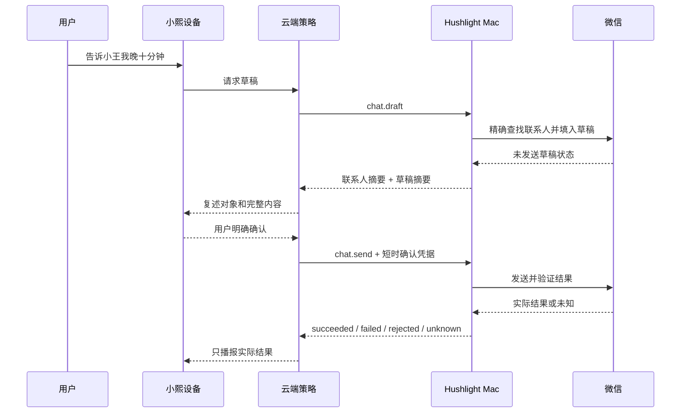

# Hushlight Mac 产品需求文档

> 文档版本：V0.2
> 更新日期：2026-08-13
> 状态：开发基线

## 1. 产品目标

让非技术用户无需命令行即可理解和控制小熙与当前 Mac 的连接、权限和本地动作，并且只看到本机真实返回的成功、失败、拒绝或未知结果。

## 2. 用户与系统角色

| 角色 | 需要 | 责任边界 |
| --- | --- | --- |
| 成年用户 | 安装一次后通过设备语音使用本地能力 | 按需授权，高风险动作明确确认 |
| 小熙设备 | 提交动作并播报 Bridge 实际结果 | 不直接操作 Mac，不假设动作成功 |
| 云端策略 | 阶段二生成工具请求和 L3 确认凭据 | 不绕过 Bridge 本地权限与策略 |
| Hushlight Mac | 执行动作、返回结果、展示状态 | 不承担聊天、记忆、订阅或设备运动 |
| Web 大本营 | 账户、设备、配置、下载和完整诊断入口 | 不直接控制本地应用 |
| 开发测试台 | 阶段一构造可复现请求 | 仅 Debug 可用，不进入 Release |

## 3. 范围

### 3.1 范围内

- 菜单栏状态入口、管理窗口、可选 Dock 图标。
- 局域网设备发现、配对和加密连接；阶段二云端长连接。
- 权限状态、恢复路径、一键暂停、最近动作和脱敏诊断。
- 系统音量、计时器、提醒事项、白名单内容、媒体控制、网易云和微信适配器。
- 官网 DMG、签名、公证、更新、回滚、登录项和卸载。

### 3.2 范围外

- Mac 内文字或语音聊天、角色表现、情绪判断、记忆和订阅管理。
- ASR、TTS、模型路由、摄像头、麦克风和设备运动控制。
- 任意 Shell、任意文件读写、任意 URL、支付、批量删除和未注册工具。
- 坐标盲点点击、永久免确认消息发送、无法验证却返回成功。
- V1 内直接向第三方开放 MCP；后续 MCP 网关必须复用相同策略和执行链。

## 4. 用户旅程

### 4.1 阶段一研发闭环

真实设备和测试台必须进入相同命令路由；测试台不得直接调用适配器。

### 4.2 上市使用

Bridge 不在线时基础聊天继续，本地动作明确不可用。

### 4.3 微信消息

## 5. 功能需求

| ID | 需求 | 优先级 | 验收摘要 |
| --- | --- | ---: | --- |
| MAC-FR-001 | 菜单栏显示连接、暂停和异常状态 | P0 | 与管理窗口状态一致 |
| MAC-FR-002 | 管理窗口展示权限、最近动作和恢复路径 | P0 | 不显示伪造的在线或成功数据 |
| MAC-FR-003 | Dock 图标默认隐藏，可由用户切换并在重启后生效 | P1 | 两种模式均可打开管理窗口 |
| MAC-FR-004 | 一键暂停全部本地动作 | P0 | 执行边界立即拒绝新请求 |
| MAC-FR-005 | Debug 测试台和真实设备共用 `bridge-v1` | P0 | Release 不包含测试台入口或实现 |
| MAC-FR-006 | 局域网通过 Bonjour 自动发现并完成安全配对 | P0 | 未配对、过期或重放请求被拒绝 |
| MAC-FR-007 | 阶段二通过出站 WSS 连接云端 | P0 | 重连不重放 L3 请求 |
| MAC-FR-008 | 系统音量可读取、绝对设置和步进调整 | P0 | 执行后回读值一致 |
| MAC-FR-009 | 本地计时器可创建、修改、取消并跨重启恢复 | P0 | 到时发出系统通知 |
| MAC-FR-010 | macOS 提醒事项可创建、修改和取消 | P0 | EventKit 拒绝时给出恢复路径 |
| MAC-FR-011 | 只打开注册 Bundle ID 和 HTTPS 域名 | P0 | 白名单外目标全部拒绝 |
| MAC-FR-012 | 通用媒体播放、暂停、上一首和下一首 | P0 | 返回实际媒体状态或未知 |
| MAC-FR-013 | 网易云搜索并播放指定内容 | P0 | 实际曲目可验证；不确定时返回未知 |
| MAC-FR-014 | 微信生成未发送草稿 | P0 | 联系人歧义、内容为空或版本不兼容时停止 |
| MAC-FR-015 | 微信仅在明确确认后发送 | P0 | 未确认发送数为 0，重复请求不重复发送 |
| MAC-FR-016 | 最近动作只保留脱敏元数据 | P0 | 最多 500 条或 7 天 |
| MAC-FR-017 | 导出脱敏诊断包 | P1 | 最多 20 MB 或 7 天，不含敏感字段 |
| MAC-FR-018 | 官网分发版本可安装、更新、回滚和卸载 | P0 | 全新环境发布 Gate 通过 |

## 6. 状态、权限和动作规则

### 6.1 Bridge 状态

| 状态 | 进入条件 | 允许动作 | 用户可见结果 |
| --- | --- | --- | --- |
| `NotConfigured` | 未完成配对或登录绑定 | 打开设置、查看权限 | 未配置 |
| `Pairing` | 局域网配对码有效 | 完成或取消配对 | 正在配对 |
| `Connecting` | 正在建立 LAN 或 Cloud 通道 | 暂停、查看诊断 | 连接中 |
| `Online` | 通道鉴权和心跳正常 | 按权限执行注册动作 | 已连接 |
| `Paused` | 用户主动暂停 | 诊断、恢复 | 已暂停，动作拒绝 |
| `Unavailable` | 权限、网络、协议或内部错误 | 恢复、诊断 | 明确原因和恢复路径 |

### 6.2 权限

- 本地网络：阶段一发现与连接需要；macOS 15+ 必须提供用途说明和拒绝恢复路径。
- 辅助功能：仅在网易云或微信没有稳定正式接口时按需申请。
- 自动化：仅在调用受支持应用的正式自动化接口时申请。
- 通知：本地计时器和动作结果需要。
- 提醒事项：只有用户启用系统提醒事项能力时申请。
- 不申请麦克风、摄像头、通讯录全量读取或全磁盘访问。

### 6.3 结果和确认

- 最终结果只能是 `succeeded`、`failed`、`rejected` 或 `unknown`。
- “已接收”“已发起”不是成功。
- 相同 `request_id` 返回已有结果，不重复产生副作用。
- `chat.send` 属于 L3：不得自动重试；确认凭据必须绑定草稿、联系人、设备和短有效期。
- 草稿改变、超时、断线、应用状态未知或联系人不唯一时确认立即失效。

## 7. 非功能要求

| 类别 | 要求 |
| --- | --- |
| 兼容 | macOS 13+；macOS 15+ 单独验证本地网络隐私 |
| 稳定 | 连续 8 小时、至少 50 次动作循环，无非预期重启或状态卡死 |
| 安全 | 传输加密、凭据进 Keychain、请求防重放、默认拒绝未注册动作 |
| 隐私 | 日志不含消息正文、联系人、令牌和敏感路径 |
| 可维护 | 每个应用适配器绑定支持版本和稳定元素语义，单独停用不影响其他能力 |
| 可追溯 | 每个 P0 需求映射协议、适配器规格和验收 ID |

## 8. 外部依赖

- 阶段一：可用参考/自研设备、网易云测试版本、微信测试账号和测试联系人。
- 阶段二：云端/Web Owner、设备固件 Owner、测试 Owner、登录绑定接口和云端 WSS 环境。
- 阶段三：Apple Developer Program、Developer ID、下载域名、更新源和 Sparkle 供应链评审。

## 9. 需求追踪

| 需求 | 协议/规格 | 验收 |
| --- | --- | --- |
| MAC-FR-001–007 | `08_bridge_protocol.md` | MAC-AC-UI、MAC-AC-LAN、MAC-AC-CLD |
| MAC-FR-008–015 | `09_local_adapter_spec.md` | MAC-AC-SYS、MAC-AC-MUS、MAC-AC-CHT |
| MAC-FR-016–017 | `03_architecture.md` 数据边界 | MAC-AC-LOG |
| MAC-FR-018 | `02_roadmap.md` 阶段三 | MAC-AC-REL |
