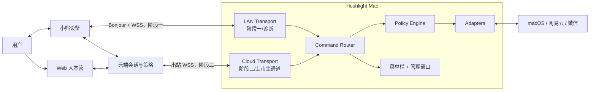
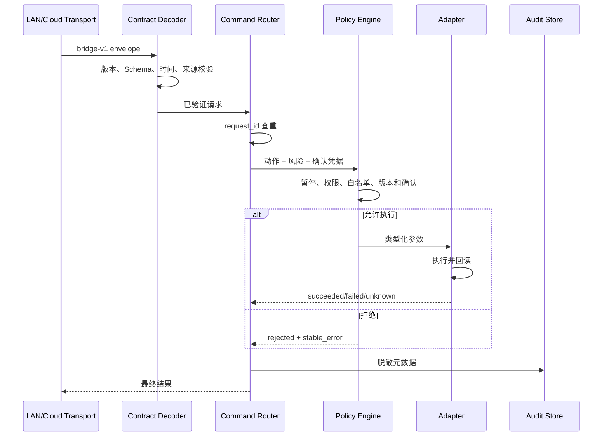

# Hushlight Mac 技术架构

> 文档版本：V0.2
> 更新日期：2026-08-13
> 状态：开发基线

## 1. 架构结论

Hushlight Mac 采用“单一执行核心 + 双 Transport + 隔离适配器”。阶段一局域网 WSS 和阶段二云端 WSS 只负责传输，同一 `bridge-v1` 请求必须经过 `CommandRouter → PolicyEngine → Adapter → Result`。Debug 测试台也只能进入该链路。

## 2. 输入基线

- 根产品基线：`../../docs/01_prd.md`。
- 根决策：`../../docs/07_decisions.md` 中 D-003、D-004、D-005、D-006、D-007、D-010、D-011、D-012、D-020。
- Mac 需求：`01_prd.md`。
- 协议：`08_bridge_protocol.md`。
- 适配器规格：`09_local_adapter_spec.md`。

## 3. 系统上下文与阶段差异

阶段一 LAN 是研发主通道和后续诊断能力，不是上市默认路由。阶段二以后设备动作由云端策略下发；Bridge 不开放公网入站端口。

## 4. 进程与模块

首版保持单一用户态 App 进程，不增加特权 Helper。适配器在代码边界和能力注册表中隔离；只有经过支持版本和故障证据证明单进程不足时，才另行评审 XPC 拆分。

| 模块 | 职责 | 禁止 |
| --- | --- | --- |
| App Shell | 生命周期、菜单栏、管理窗口、Dock 策略 | 直接执行工具 |
| State Store | 聚合连接、权限、能力和最近动作 | 保存消息正文或令牌 |
| LAN Transport | Bonjour、WSS、配对和设备会话 | 绕过协议校验 |
| Cloud Transport | 登录令牌、出站 WSS、心跳和重连 | 自主重放 L3 |
| Contract Decoder | 版本、消息类型和 Schema 校验 | 宽松接受未知字段语义变化 |
| Command Router | 请求查重、路由、生命周期 | 直接调用系统私有行为 |
| Policy Engine | 暂停、权限、风险、确认、白名单和版本判断 | 将“已发起”变成成功 |
| Capability Registry | 工具、适配器、版本和启停状态 | 注册任意 Shell 或文件访问 |
| Adapters | 参数校验、执行、回读和错误归一 | 跨适配器扩大权限 |
| Audit Store | 脱敏动作元数据和滚动诊断 | 保存联系人、正文、令牌和敏感路径 |

## 5. 执行链

`ack` 只表示已接收。只有 Adapter 回读或有明确定义的系统成功证据时才能返回 `succeeded`。

## 6. 局域网连接与配对

- Network.framework 发布 `_hushlight-bridge._tcp` Bonjour 服务，端口由系统分配。
- Info.plist 声明 `NSLocalNetworkUsageDescription` 和使用的 Bonjour 服务类型；macOS 15+ 单独验证允许、拒绝和恢复。
- 使用 WSS；Bridge 生成本机自签名 TLS 身份，设备在配对时固定公钥指纹。
- 配对码为一次性、5 分钟有效，连续失败限流；配对成功后生成 256 位随机密钥。
- Bridge 私钥、配对密钥和云端刷新凭据进入 Keychain；设备侧密钥进入其安全存储。
- 请求校验 `request_id`、`issued_at`、`expires_at` 和 `nonce`；重放缓存至少覆盖请求有效期和已完成结果保留期。
- 阶段一真实设备和 Debug 测试台使用同一握手和命令协议。Release 不编译测试台。

## 7. 云端连接

- Bridge 通过 Web 登录回跳获得一次性授权码，换取短期访问令牌和刷新凭据。
- 仅建立出站 WSS；心跳、指数退避和抖动重连不得重放已过期或 L3 请求。
- 连接建立后上报版本、平台、能力、适配器支持版本、权限和暂停状态，不上报本地消息正文。
- 云端可停用单个能力；本地权限、暂停和版本判断始终拥有最终拒绝权。
- LAN 与 Cloud 只实现 `BridgeTransport` 接口，不拥有动作语义。

## 8. 风险、确认与幂等

| 风险 | 示例 | 执行规则 |
| --- | --- | --- |
| L0 | 状态和能力查询 | 已鉴权即可读取脱敏结果 |
| L1 | 音量、媒体控制、打开白名单内容 | 已授权可执行，必须回读 |
| L2 | 创建/修改计时器、提醒事项、搜索播放 | 已授权执行，参数完整且可追踪 |
| L3 | 微信发送 | 草稿、复述、短时确认、单次发送、禁止自动重试 |
| L4 | Shell、支付、任意文件、批量删除 | 不注册、不执行 |

确认凭据绑定用户、设备、Bridge、工具、联系人稳定标识、草稿摘要和有效期。草稿或收件人变化、断线、超时、应用状态未知或使用过一次后立即失效。

## 9. 适配器策略

接入优先级为系统正式接口、应用正式接口/URL Scheme、稳定合规的云端 API、AXUIElement。使用 AXUIElement 时必须：

- 绑定已测试应用版本。
- 只按角色、标题、标识等稳定语义查找元素。
- 不通过屏幕坐标盲点点击。
- 校验目标应用、窗口和关键状态。
- 超时、元素缺失、版本未知或结果不可验证时停止并返回失败或未知。
- 单个适配器可被本地或云端停用，不影响其他能力。

## 10. 数据与隐私

| 数据 | 位置 | 保留 | 约束 |
| --- | --- | --- | --- |
| TLS 私钥、配对密钥、刷新凭据 | Keychain | 绑定/登录存续期 | 不导出到诊断包 |
| 非敏感偏好、Dock 和自启选择 | UserDefaults | 安装存续期 | 不保存凭据 |
| 计时器状态 | Application Support | 完成/取消后删除 | 原子写入，重启恢复 |
| 动作元数据 | Application Support | 最多 500 条或 7 天 | 工具、时间、结果、错误码；无正文/联系人 |
| 滚动诊断 | Application Support | 最多 20 MB 或 7 天 | 无令牌、正文和敏感路径 |
| 关系与偏好记忆 | 云端 | 根产品规则决定 | Bridge 不拥有权威副本 |

卸载说明区分应用删除、登录项注销和可选本地数据清理；注销必须删除云端刷新凭据和绑定密钥。

## 11. 应用、权限与交付

- 阶段一建立 Xcode `.app` target，Bundle ID 固定为 `com.hushlight.bridge.mac`，使用 Development signing；这不代表正式产品交付。
- 最低 macOS 13。Dock 默认隐藏；用户切换后调整激活策略并重启应用。
- 开机启动只由用户选择，阶段三使用 `SMAppService`；不写入 LaunchAgent plist，不请求管理员权限。
- 官网分发不启用 App Sandbox，阶段三启用 Hardened Runtime、Developer ID、secure timestamp、`notarytool` 和 stapling。
- 自动更新固定 Sparkle `2.9.4`，使用精确版本、EdDSA appcast、灰度渠道和上一版本回滚；引入前必须完成依赖登记和安全评审。

## 12. 故障和降级

| 故障 | 行为 |
| --- | --- |
| 本地网络被拒绝 | LAN 进入不可用，展示系统设置恢复路径；不影响 Cloud |
| 云端离线 | 不接受新远程动作；设备保留基础聊天 |
| Bridge 暂停 | 保持诊断和恢复入口，全部工具请求返回 `rejected` |
| 权限缺失 | 只停用对应能力，返回权限错误和恢复路径 |
| 应用未安装或版本不兼容 | 停用对应适配器，不自动安装、不盲操作 |
| 适配器超时 | 返回 `failed` 或 `unknown`；L3 不自动重试 |
| 更新失败 | 恢复上一可用版本，不恢复待执行 L3 请求 |
| 日志或存储写入失败 | 动作结果不因日志失败改变；诊断状态明确降级 |

## 13. 架构待输入

| 输入 | Owner | 截止 Gate |
| --- | --- | --- |
| 云端登录、WSS 和确认凭据接口 | 云端/Web Owner | S2 开始前 |
| 设备侧 `bridge-v1`、TLS 和安全存储实现 | 设备固件 Owner | S1 Gate 前 |
| 网易云安装包和支持版本 | macOS/Test Owner | S1-W4 开始前 |
| 微信测试账号和测试联系人 | 产品/Test Owner | S1-W5 开始前 |
| Apple 证书、域名和更新源 | 项目负责人 | S3 开始前 |
