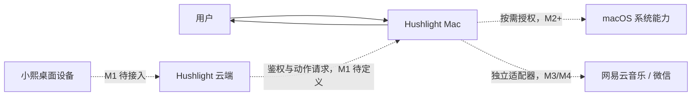
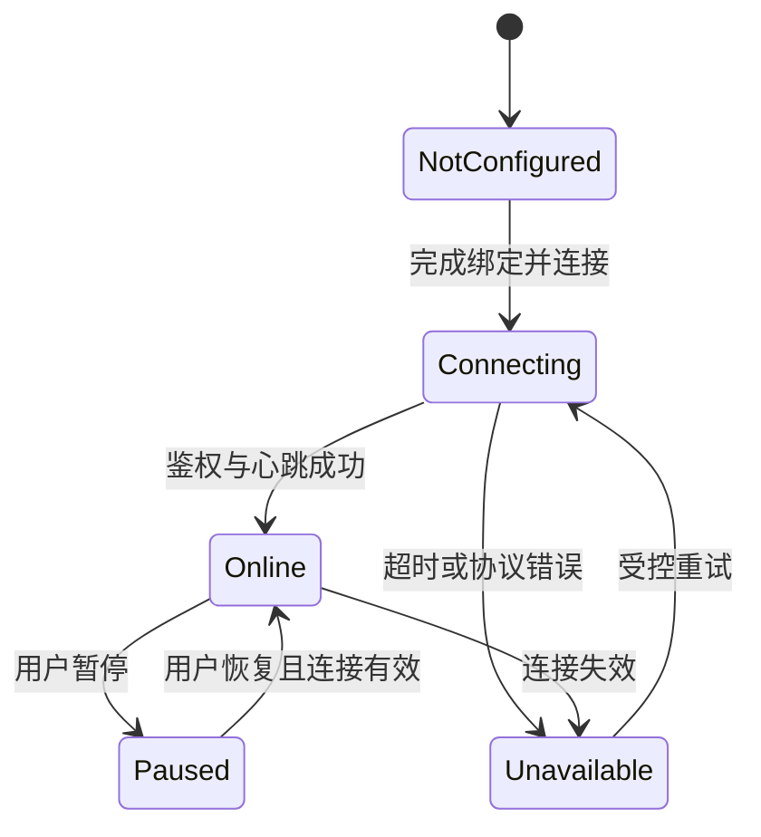

# Hushlight Mac 技术架构

## 1. 目标与输入基线

- 产品基线：根目录 `docs/00_overview.md`、`docs/01_prd.md`。
- 决策基线：D-003、D-004、D-005、D-007、D-010、D-011、D-012。
- 当前目标：形成可替换服务实现的 macOS 原生壳，不提前绑定尚未确定的云端协议。

## 2. 系统上下文

虚线均为未实现边界；M0 只包含本地应用壳和占位服务。

## 3. 分层架构

| 层 | 职责 | 当前实现 |
| --- | --- | --- |
| App | 生命周期、窗口、菜单栏 | `HushlightMacApp` |
| Feature | 状态、权限、动作记录界面 | `DashboardView`、`MenuBarView` |
| Domain | 跨 UI/服务的稳定模型 | `BridgeStatus`、`PermissionStatus`、`ActionRecord` |
| Service | 云端、系统与适配器边界 | `BridgeService` |
| Placeholder | M0 诚实的未配置实现 | `PlaceholderBridgeService` |

## 4. 状态和失败规则

- M0 只实现 `NotConfigured` 与本地 `Paused` 往返。
- 真实服务接入后，暂停状态必须在执行边界再次校验，不能只依赖 UI。
- L3 消息发送请求不得自动重试；未知结果进入人工确认，不得报成功。

## 5. 安全与数据边界

- 凭据后续存入 Keychain，不写入源码、UserDefaults 或日志。
- 动作记录默认不保存消息正文、令牌和敏感路径。
- 权限按功能申请，关闭能力后不继续调用对应系统接口。
- 云端是关系与偏好记忆权威；Mac 端只保存运行所需缓存。

## 6. 兼容与交付

- M0 最低系统为 macOS 13，使用 Swift 6 和 SwiftUI。
- SwiftPM 用于快速构建与测试；M1 增加正式 Xcode App target、Bundle ID、签名与 Entitlements。
- macOS 与 Windows 可使用不同框架，但工具名、参数、权限、确认、错误与结果 Schema 必须一致。

## 7. 待决策

| 项目 | Owner | 最迟时间 |
| --- | --- | --- |
| 云端连接协议与鉴权 | 云端 + macOS | M1 开发前 |
| Bundle ID、Team、发布渠道 | 项目负责人 | M1 打包前 |
| 自动更新方案 | macOS | M5 开发前 |
| 网易云和微信正式接入方式、支持版本 | macOS | M3/M4 开发前 |
