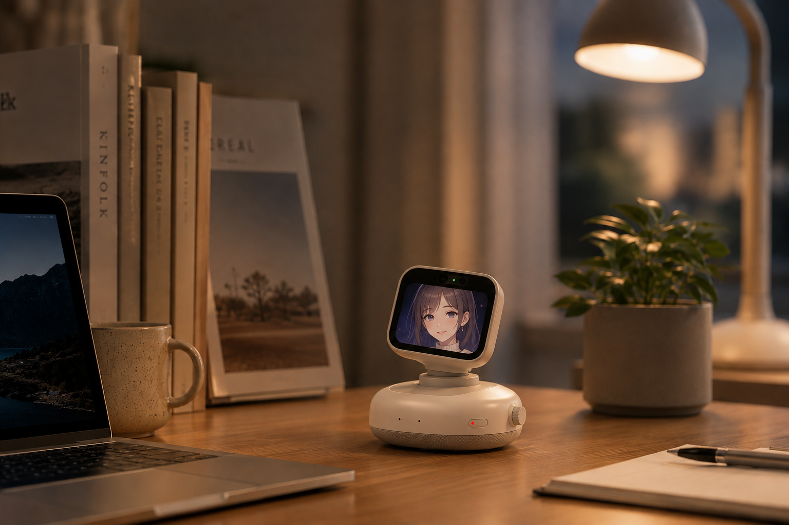
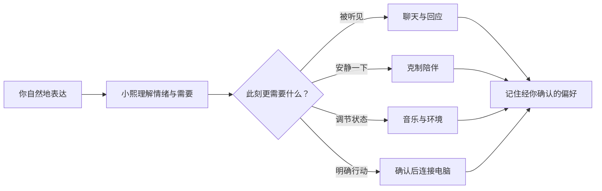

# Hushlight · 小熙

### 懂得陪你，也能在你需要时替你做一件小事

面向电脑桌面的 AI 情绪陪伴伙伴。 
自然聊天、情绪理解、音乐陪伴，以及明确请求后的轻量行动。

> 产品概念效果图：用于介绍固定底座、双轴轻量头部和屏幕角色陪伴的目标体验；不代表已冻结的消费版工业设计、量产规格或实机验收状态。

---

## 小熙是什么

小熙不是把工作助手换成可爱语气，也不是一个只会等待提问的聊天窗口。

她更像是长期待在电脑旁边的一个小伙伴：想聊时会认真回应，疲惫时能陪你安静一会儿，听懂你真正需要的是倾诉、音乐、休息，还是请她帮你完成一个简单动作。

> 陪伴是产品本体，行动是自然延伸。

## 为什么是电脑旁边

手机已经足够便携，但电脑桌前仍是一段很长、也很容易疲惫和孤独的时间。

小熙选择固定在电脑附近，不要求用户再随身携带一台设备。她在这个场景中拥有清晰的角色：

- 陪你度过工作、学习、创作和独处的间隙；
- 用表情、朝向和轻微动作回应，而不只是输出文字；
- 在获得允许后，连接电脑上的音乐、提醒和常用应用；
- 把复杂设置留在网页里，让日常交流尽量回到自然语言。

## 有存在感的桌面伙伴

小熙由固定底座和可以水平、俯仰转动的轻量头部组成。屏幕是她的面孔，摄像头只在需要对话定位时启用。

她不会在待机时一直跟随或巡视。被叫醒后，她才会寻找当前对话者，平滑地转向你；对话结束后，回到安静的休息状态。

这些动作不是为了展示机械能力，而是成为表达的一部分：

- 叫到名字时轻轻抬头；
- 听你说话时保持自然朝向；
- 理解和确认时轻微点头；
- 思考时稍稍低头或歪头；
- 困倦、开心、关切、歉意都有一致的表情与身体语言。

## 不只是聊天

小熙平时可以独立聊天。当你提出明确请求时，她也能通过电脑完成有限、可理解的动作。

| 你可能会说 | 小熙可以做什么 |
|---|---|
| “今天有点累。” | 先理解你更想倾诉、安静，还是听点音乐 |
| “放点轻松的歌吧。” | 在网易云音乐中选择并开始播放合适的内容 |
| “声音小一点。” | 调低电脑或播放设备的音量 |
| “半小时后提醒我休息。” | 建立一个清晰可见的提醒 |
| “帮我跟她说我晚点回复。” | 生成消息草稿，复述联系人和内容，确认后再发送 |

行动失败、电脑未连接或权限不足时，小熙会明确告诉你发生了什么，不会为了维持对话而假装成功。

## 一段自然的互动

小熙关注的不是单一“情绪标签”，而是情绪背后的需要。难过不一定需要被安慰，疲惫也不一定需要建议；有时最合适的回应只是少说一点、播放熟悉的音乐，或者静静待在旁边。

## 小熙会记得什么

长期陪伴需要记忆，但记忆不应该变成没有边界的收集。

小熙优先记住经你确认、确实能改善体验的信息，例如：

- 喜欢或不喜欢的音乐类型；
- 希望被怎样称呼；
- 哪些时候不希望被主动打扰；
- 经常使用的提醒方式；
- 你主动告诉她的重要偏好和边界。

记忆应当可以查看、纠正和删除。临时情绪、无关对话和本地敏感信息不会因为“可能有用”就自动变成长期记忆。

## 主动，但不打扰

小熙可以主动关心，但不会以增加对话时长为目标。

- 遵守静默时段和主动频率限制；
- 连续被忽略后自动降低频率；
- 不用告别挽留、情绪施压或关系暗示促使用户留下；
- 用户随时可以暂停主动关怀、麦克风和电脑连接能力；
- 安静陪伴与结束对话都是正常结果。

## 产品组成

| 部分 | 用户感受到的作用 |
|---|---|
| **桌面设备** | 语音、表情、触摸与轻微身体语言形成真实存在感 |
| **Web 大本营** | 管理账户、设备、角色、模式、记忆、权限与订阅 |
| **PC Bridge** | 在 macOS/Windows 上连接音乐、音量、提醒和受支持应用 |
| **云端服务** | 支撑自然对话、状态理解、记忆与多设备连续体验 |

日常使用以语音和设备交互为主。网页负责低频配置，PC Bridge 负责本地能力，不要求用户面对命令行或理解工具调用过程。

## 产品原则

1. **先陪伴，再行动**：没有明确请求或接受建议，不主动扩大动作范围。
2. **安静也是回应**：不把持续说话、挽留和对话时长当作成功。
3. **结果必须真实**：失败、离线或权限缺失时清楚说明。
4. **重要动作必须确认**：对外发送消息前，展示并复述对象和内容。
5. **隐私状态必须看得见**：静音、摄像头工作和物理遮挡都有明确反馈。
6. **减少操作负担**：复杂设置集中在 Web，日常尽量通过自然语言完成。

## 产品边界

- 面向成年用户，不定位为儿童或老人照护设备。
- 不提供心理诊断、医疗建议或危机干预替代服务。
- 不以虚拟恋人、排他关系或情感依赖作为产品卖点。
- 不开放任意 Shell、支付、批量删除等高风险电脑操作。
- 不在待机状态持续进行摄像头分析或环境录像。

---

**Hushlight — a little light that stays with you.**

