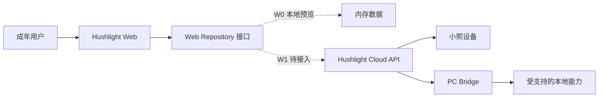
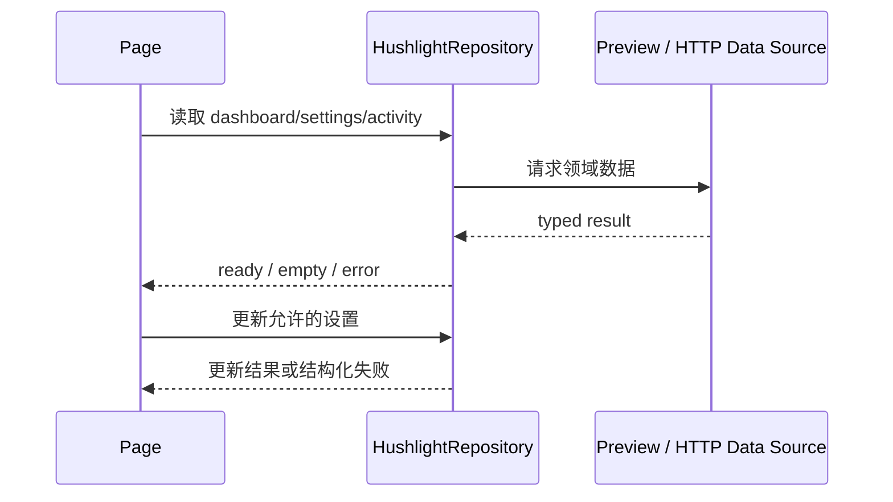

# Hushlight Web 技术架构

> 文档版本：V0.1  
> 设计状态：W0 实施基线；云端 API 契约待 W1 冻结。

## 1. 架构结论

采用 React + TypeScript + Vite 的模块化单体 SPA。视图通过领域 Repository 获取数据；W0 使用内存实现，W1 用 HTTP 实现替换。页面不直接依赖 Mock，不在前端保存长期权威数据，也不直接连接本地应用。

## 2. 输入基线

- 产品：`../../docs/01_prd.md` 中 FR-WEB-001 至 FR-WEB-008。
- 系统边界：`../../docs/03_architecture.md` 中 Web、云端和 Bridge 所有权。
- 决策：D-003、D-004、D-007、D-008、D-009、D-012。

## 3. 系统上下文

## 4. 分层架构

| 层 | 目录 | 职责 |
| --- | --- | --- |
| App | `src/app` | 路由、布局、依赖装配 |
| Pages | `src/pages` | 页面编排与用户任务 |
| Features | `src/features` | 可复用业务区块与交互 |
| Domain | `src/domain` | 稳定类型、状态语义、Repository 契约 |
| Data | `src/data` | W0 内存实现；W1 HTTP 实现 |
| UI | `src/components` | 无业务所有权的基础组件 |
| Styles | `src/styles` | Token、布局、响应式与无障碍基线 |

## 5. 数据与状态

- 服务端状态由 Repository 返回；W1 引入查询缓存时不改变页面契约。
- 仅导航和未提交表单属于本地 UI 状态。
- `source: preview | live` 必须随数据返回并在 UI 可见。
- 未来写操作使用版本号或 ETag 防止静默覆盖；失败后保留用户输入。
- Provider 分离首次读取错误和写操作错误；读取支持原位重试，写入失败不清空最近有效快照。
- 同一时刻只允许一个预览写操作，页面在保存期间禁用重复提交。W1 接入 HTTP 后仍需由服务端提供幂等和冲突保护。

## 6. 安全与权限边界

- 浏览器不保存 Bridge 密钥、设备长期令牌或消息正文日志。
- W1 使用安全 Cookie 会话；不把长期凭据放入 `localStorage`。
- Web 表达权限意图，真实系统权限由 Bridge 校验和执行。
- L3 消息发送仍由云端确认令牌和 Bridge 双重校验，Web 不提供绕过路径。
- 所有日志与错误展示使用可公开错误码，不回显敏感堆栈或凭据。

## 7. 技术选型

| 选择 | W0 结论 | 原因 |
| --- | --- | --- |
| React + TypeScript | Accepted | 组件化、稳定类型边界、适合复杂控制台演进 |
| Vite | Accepted | 官方 React 模板、快速本地开发和生产构建 |
| React Router | Accepted | 信息架构需要稳定 URL 和响应式 App Shell |
| 原生 CSS + Token | Accepted | W0 视觉量有限，避免提前绑定大型组件库 |
| Vitest + Testing Library | Accepted | 覆盖领域规则与关键可见行为 |
| Playwright 1.61.1 | Accepted | 固化四个目标视口、路由、交互、控制台和溢出回归 |
| TanStack Query | Deferred to W1 | 真实异步 API、缓存与失效策略冻结后再引入 |

## 8. 失败与降级

| 情况 | 可见行为 |
| --- | --- |
| 云端不可用 | 页面保留结构，显示无法刷新和重试入口，不伪造旧状态为实时 |
| 未登录 | 进入登录流程，保留安全的目标页地址 |
| 无设备 | 展示绑定入口，不阻断 Bridge 下载信息 |
| Bridge 离线 | 基础设置仍可查看；本地能力明确不可用 |
| 保存冲突 | 显示服务器新版本，要求用户比较后重试 |
| 权限不足 | 隐藏敏感内容并说明所需角色，不以通用错误代替 |
| 首次读取失败 | 显示读取失败和“重新读取”，不渲染伪造快照 |
| 写入失败 | 保留最后一次有效快照，提示未保存并允许用户重试 |

## 9. 待决策

- 云端 API 的 Base URL、版本、鉴权、错误码和追踪 ID。
- 账户登录方式和设备扫码绑定协议。
- Bridge 安装包发布、签名、版本清单和下载校验。
- 订阅与计费供应商。
