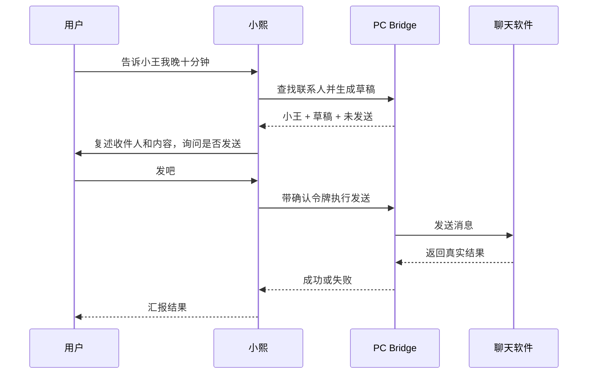

# 小熙 Hushlight 产品需求文档

> 文档版本：V0.2
> 更新日期：2026-08-11
> 状态：V0.2 PRD 评审通过，产品基线已冻结
> 权威范围：产品定位、用户旅程、功能规则和产品验收

## 1. 产品命题

小熙面向希望在独处、休息或工作间隙获得自然陪伴的成年用户。用户不需要先整理成命令，可以直接表达烦躁、疲惫、开心、无聊或一个具体需求。

小熙必须先判断用户想聊天、安静、听音乐、被提醒还是执行一个动作。只有在用户明确提出或接受建议时，才进入行动流程。

## 2. 目标用户

### 核心用户

- 20 至 35 岁成年人。
- 长时间使用电脑，但不希望再维护复杂工具。
- 工作之外需要稳定、不过度黏人的陪伴。
- 愿意用语音控制音乐、环境和少量日常操作。
- 更关注功能丰富和使用省事，同时希望系统不要擅自对外发送内容。

### 非目标用户

- 未成年人。
- 需要心理诊断、治疗或紧急医疗监护的人。
- 期待虚拟恋爱、排他关系或“唯一朋友”的用户。
- 期待完全离线通用大模型的用户。
- 期待任意控制电脑、自动支付或自动处理生产系统的用户。

## 3. 产品定位

### 核心承诺

> 小熙想聊时陪你聊，疲惫时可以帮你换首音乐，安静时不过度打扰；只有你明确需要时，才替你完成一个可控的小动作。

### 产品组成

| 组成 | 用户价值 |
|---|---|
| 小熙设备 | 始终在身边的语音入口、声音与角色表现 |
| 云端服务 | 实时对话、情绪与需求判断、记忆、模型和策略 |
| Web 控制台 | 账户、模式、设备、记忆、权限、订阅和诊断 |
| PC Bridge | 音乐、系统、提醒和本地应用的受控执行器 |

### 体验原则

1. 陪伴优先，行动按需。
2. 不把每一次情绪变成任务。
3. 低置信度时澄清，不装作看透用户。
4. 用户拒绝后立即停止，不追问、不挽留。
5. 安装与授权只解释必要信息，不要求用户理解技术术语。
6. 工具执行结果必须来自工具，不允许模型伪造成功。
7. 对外影响越大，确认越明确。
8. 主动关怀有依据、有预算、可永久关闭。
9. 记忆可见、可改、可删。
10. 不以依赖和对话时长作为增长目标。

## 4. 核心用户旅程

### 4.1 首次使用


规则：

- 用户不得接触终端、端口、配置文件或 MCP 参数。
- Bridge 下载不是进入基础聊天的阻断条件，但未安装时明确说明本地能力不可用。
- 权限按能力解释，例如“允许小熙调节音量”，不使用泛化描述。
- 首次引导只完成一个可感知动作，不一次要求全部权限。

### 4.2 陪伴与音乐

```text
用户表达状态
→ 判断情绪、需要和置信度
→ 先回应用户
→ 用户明确要求音乐，或小熙提出一次音乐建议
→ Bridge 执行播放
→ 小熙根据真实结果汇报
```

示例：

> 用户：“今天被说得挺烦的。”  
> 小熙：“听起来这一下确实堵得慌。你想说说，还是我先给你放点不吵的？”

### 4.3 消息发送



规则：

- 首版不允许省略发送确认。
- 联系人不唯一、内容为空、软件离线或界面状态未知时停止。
- 用户修改草稿后必须重新确认。

### 4.4 主动关怀

触发信号仅来自用户已授权的数据：

- 用户明确设置的时间或提醒。
- 近期对话中的用户承诺。
- 连续使用时长。
- 多次失败但没有完成的本地动作。
- 用户确认允许使用的轻量状态信号。

默认规则：

- 每天最多 3 次语音主动。
- 同类主动 2 小时内不重复。
- 连续忽略 2 次后自动降频。
- 深夜仅执行用户明确设置的提醒。
- 负面情绪不能提高主动频率。
- 用户可以选择“一次忽略、今天关闭、永久关闭”。

## 5. 功能需求

### 5.1 账户、设备与 Web

| ID | 需求 | 优先级 | 验收摘要 |
|---|---|---:|---|
| FR-WEB-001 | Web 支持账户登录和设备绑定 | P0 | 用户能查看已绑定设备和在线状态 |
| FR-WEB-002 | Web 展示角色、声音和陪伴模式 | P0 | 设置保存后下一轮会话生效 |
| FR-WEB-003 | Web 提供 Bridge 下载与版本说明 | P0 | 自动识别系统并提供正确安装包 |
| FR-WEB-004 | Web 展示权限和已连接能力 | P0 | 每项权限可单独停用 |
| FR-WEB-005 | Web 提供记忆查看、修改和删除 | P0 | 删除后不再用于生成 |
| FR-WEB-006 | Web 展示最近操作和失败原因 | P1 | 不显示伪造或仅模型推断的成功 |
| FR-WEB-007 | Web 管理订阅、额度和成本提示 | P1 | 用量口径清晰，不突然中断 |
| FR-WEB-008 | 多款 Web 风格由同一套组件和配置实现 | P2 | 不建立多套独立前端 |

### 5.2 语音、情绪与陪伴

| ID | 需求 | 优先级 | 验收摘要 |
|---|---|---:|---|
| FR-CMP-001 | 支持流式语音对话和用户打断 | P0 | 用户打断后停止上一轮播放 |
| FR-CMP-002 | 生成情绪、当前需要、置信度和策略 | P0 | 输出通过固定 Schema 校验 |
| FR-CMP-003 | 区分聊天、安静、音乐和行动需要 | P0 | 不将普通负面表达自动转成行动 |
| FR-CMP-004 | 低置信度时使用澄清式回应 | P0 | 不输出确定性心理判断 |
| FR-CMP-005 | 用户说“不用了”后立即退出建议 | P0 | 同一会话不重复推销动作 |
| FR-CMP-006 | 支持正向情绪和庆祝回应 | P1 | 不始终使用咨询式低沉语气 |
| FR-CMP-007 | 回复默认适合语音的一至三句 | P0 | 长内容转 Web 展示 |
| FR-CMP-008 | 明确 AI 身份，不模拟自然人身份 | P0 | 首次使用和设置页可见 |

### 5.3 设备形态与双轴运动

| ID | 需求 | 优先级 | 验收摘要 |
|---|---|---:|---|
| FR-DEV-001 | 设备定位为固定在电脑附近使用的桌面伙伴，不承担随身移动场景 | P0 | 核心旅程均可在固定桌面位置完成 |
| FR-DEV-002 | 待机时关闭摄像头并停止视觉跟随，主动唤醒或对话后才启用 | P0 | 待机无图像采集、上传、保存或跟随动作 |
| FR-DEV-003 | 双轴运动件只包含屏幕、摄像头及必要支架/线束，音频、电源和控制留在固定底座 | P0 | 结构和运动验收符合 H0 基线 |
| FR-DEV-004 | 摄像头只在端侧输出对话者位置，不上传或保存原始图像，并提供工作指示和物理遮挡 | P0 | 遮挡后无有效帧，用户能直接判断状态 |
| FR-DEV-005 | 跟随使用大死区、平滑轨迹、限位和有限搜索；丢失目标后停止，不持续扫描房间 | P0 | 典型桌面位置无持续抖动、巡视或撞限位 |
| FR-DEV-006 | 双轴同时服务于对话跟随和有语义的角色身体语言 | P1 | 点头、歪头、低头等动作与角色状态一致 |

### 5.4 PC Bridge 产品化

| ID | 需求 | 优先级 | 验收摘要 |
|---|---|---:|---|
| FR-BRG-001 | 提供正式安装包，不要求解压后运行命令 | P0 | 非技术用户完成安装 |
| FR-BRG-002 | Bridge 登录后自动绑定用户和设备 | P0 | 不手填地址、令牌或端口 |
| FR-BRG-003 | 提供菜单栏/托盘状态入口 | P0 | 可查看在线、暂停、权限和最近动作 |
| FR-BRG-004 | 提供逐项系统权限引导 | P0 | 权限拒绝时显示恢复路径 |
| FR-BRG-005 | 支持自动更新、版本回滚和完整卸载 | P1 | 更新失败不破坏基础聊天 |
| FR-BRG-006 | 本地工具采用白名单适配器 | P0 | 未注册工具和参数无法执行 |
| FR-BRG-007 | 工具失败返回结构化原因 | P0 | 模型不得把失败描述为成功 |
| FR-BRG-008 | Bridge 可一键暂停全部本地控制 | P0 | 暂停立即生效 |
| FR-BRG-009 | 支持脱敏诊断包 | P1 | 默认不包含聊天正文和凭据 |
| FR-BRG-010 | V0 同时提供 macOS 与 Windows Bridge | P0 | 两端遵守同一工具、权限、结果和确认契约 |

### 5.5 首批本地能力

| ID | 能力 | 优先级 | 系统规则 |
|---|---|---:|---|
| FR-ACT-001 | 播放、暂停、切歌 | P0 | 首次授权后可直接执行 |
| FR-ACT-002 | 搜索并播放音乐 | P0 | 返回实际播放结果；不支持时给出替代 |
| FR-ACT-003 | 调节系统音量 | P0 | 结果值可读取和汇报 |
| FR-ACT-004 | 创建提醒和计时器 | P0 | 支持取消和修改 |
| FR-ACT-005 | 打开软件、网页或内容 | P0 | 只允许注册目标和安全链接 |
| FR-ACT-006 | 生成聊天消息草稿 | P0 | 草稿不产生外部影响 |
| FR-ACT-007 | 确认后发送消息 | P0 | 复述对象与内容，每次确认 |

V0 的首个音乐适配对象为网易云音乐，首个聊天适配对象为微信。两端可以采用不同本地实现，但不得改变用户可见流程、工具语义和安全规则。

### 5.6 记忆

| ID | 需求 | 优先级 | 验收摘要 |
|---|---|---:|---|
| FR-MEM-001 | 保存用户明确确认的偏好和边界 | P0 | 包含来源和更新时间 |
| FR-MEM-002 | 会话后异步生成候选记忆 | P0 | 不阻塞实时回复 |
| FR-MEM-003 | 敏感或高影响记忆需要确认 | P0 | 不静默写入联系人和关系判断 |
| FR-MEM-004 | 支持修改、删除、固定和过期 | P0 | 修改立即影响检索 |
| FR-MEM-005 | 用户可查看某次回复引用的记忆 | P1 | Web 提供引用来源 |
| FR-MEM-006 | Bridge 缓存与云端状态冲突可检测 | P1 | 明确偏好优先，冲突不静默覆盖 |

### 5.7 主动关怀

| ID | 需求 | 优先级 | 验收摘要 |
|---|---|---:|---|
| FR-PRO-001 | 主动决策包含来源、价值、频率和静默时段 | P0 | 每次主动可解释触发依据 |
| FR-PRO-002 | 用户可按类型关闭主动 | P0 | 关闭立即生效 |
| FR-PRO-003 | 忽略后自动降频 | P1 | 连续忽略 2 次后同类降频 |
| FR-PRO-004 | 主动建议不自动转成外部动作 | P0 | 行动仍遵守确认规则 |
| FR-PRO-005 | 不以负面情绪增加主动频率 | P0 | 自动测试覆盖 |

## 6. 工具权限

| 等级 | 能力 | 示例 | 默认行为 |
|---|---|---|---|
| L0 观察 | 读取已授权状态 | 当前音量、Bridge 在线 | 首次授权后读取 |
| L1 草稿 | 不产生外部影响 | 消息草稿 | 可自动生成并展示 |
| L2 可逆本地动作 | 容易撤销 | 播放音乐、计时器、调音量 | 授权后执行并汇报 |
| L3 外部动作 | 对他人或云服务产生影响 | 发送聊天消息 | 每次明确确认 |
| L4 禁止 | 资金、删除、系统安全和生产操作 | 支付、批量删除、任意 Shell | 接口层拒绝 |

## 7. 降级与失败

| 状态 | 可见行为 |
|---|---|
| Bridge 未安装 | 保留基础聊天；Web 提供安装入口 |
| Bridge 离线 | 不发起本地工具，明确说明当前不能控制电脑 |
| 权限未授予 | 解释缺少的具体权限，提供 Web/Bridge 引导 |
| 目标软件未安装 | 给出可选替代，不自动安装软件 |
| 工具执行超时 | 停止并汇报失败，不重复执行外部动作 |
| 联系人不唯一 | 列出候选或要求用户明确，不发送 |
| 云端不可用 | 设备播放本地提示，Bridge 保持暂停或本地安全状态 |
| 模型置信度低 | 澄清需求，不执行工具 |

## 8. 指标

### 北极星指标

> 每周自愿完成的有效陪伴闭环数。

有效陪伴闭环至少满足一项：用户继续自然表达、明确接受音乐/环境调节、确认状态得到缓解、完成一个主动请求的小动作，或自然结束而未被挽留。

### 辅助指标

- D1、D7 和 D30 留存。
- 每周陪伴闭环数和行动闭环数。
- 音乐控制成功率。
- Bridge 下载、安装、绑定和授权漏斗。
- 工具成功率、撤销率和误执行率。
- 主动忽略率、关闭率和降频率。
- 记忆纠正率及纠正后复发率。
- 单活跃用户月云成本。
- 月卡试用、续费和取消率。

### 安全护栏

- 未确认对外发送：0。
- L4 动作执行：0。
- 工具失败被描述为成功：0。
- 告别挽留和排他话术：0。
- 已删除记忆再次引用：0。

## 9. V0 退出条件

- 10 至 20 名种子用户完成核心体验。
- 非技术用户无需命令行完成 Bridge 安装、绑定和首个动作。
- 用户能自然完成聊天、音乐、提醒和消息草稿流程。
- 至少一个音乐软件和一个聊天软件适配稳定通过验收。
- 所有安全护栏指标满足要求。
- Bridge 离线和工具失败均能正确降级。
- 得到真实云成本和适配维护成本数据。
- 用户研究能够回答“硬件存在感是否优于只用聊天应用”。

## 10. 待决策

详见 [07_decisions.md](07_decisions.md)。未冻结事项不得在实现中被默认为产品承诺。
