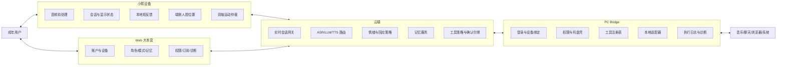
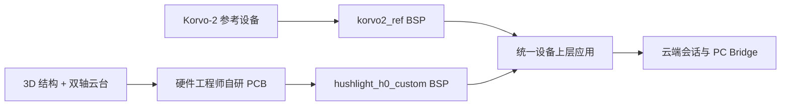
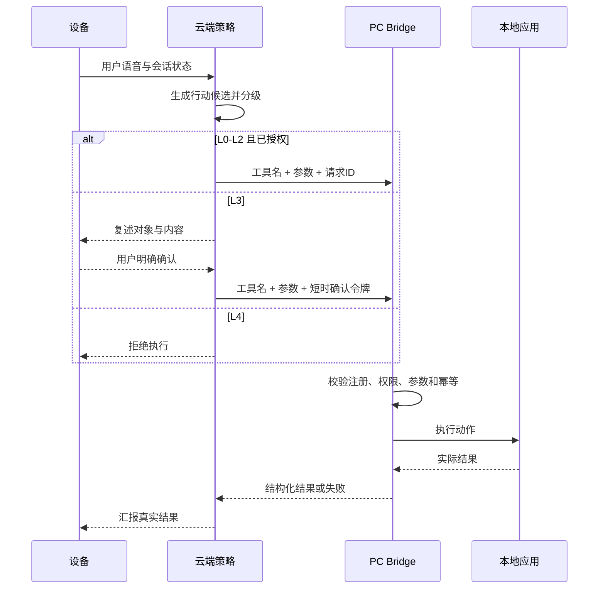

# 小熙 Hushlight 技术架构

> 文档版本：V0.4
> 更新日期：2026-08-13
> 状态：立项基线，待架构评审  
> 上游依据：[01_prd.md](01_prd.md)
> H0 专项依据：[08_hardware_prototype_plan.md](08_hardware_prototype_plan.md)

## 1. 架构结论

小熙采用“轻量设备 + 云端对话与策略 + Web 控制台 + 产品化 PC Bridge”的四端架构。Web 拥有账户和配置事实，云端拥有会话编排、工具决策及关系与偏好记忆，Bridge 拥有本地执行事实和必要缓存，设备负责实时交互和物理状态。V0 同时推进 macOS 与 Windows Bridge，由不同开发者负责，并共享同一工具、权限、确认和结果契约。

## 2. 系统上下文



## 3. 组件职责

| 组件 | 拥有的数据或状态 | 不负责 |
|---|---|---|
| 设备 | 麦克风/摄像头物理状态、联网、播放、端侧目标位置、双轴运动和交互状态 | 任意本地软件控制、长期业务决策、上传或保存原始图像 |
| 云端会话 | 会话上下文、模型路由、策略和确认状态 | 假设本地动作已经成功 |
| 云端记忆 | 用户资料、偏好、关系与项目记忆的权威版本 | 保存未经规则处理的全部原始音频 |
| Web | 账户、设备、角色、模式、权限意图、订阅和用户操作入口 | 直接控制任意本地应用 |
| Bridge | 本地连接状态、实际工具能力、权限状态、执行结果和短期缓存 | 自主扩大权限、绕过云端确认 |
| 适配器 | 一个应用或系统能力的参数校验和执行 | 访问注册范围外的应用或参数 |

### 3.1 H0 双线硬件与统一 BSP



Korvo-2 参考线用于立即开展 macOS、Windows 软件联调；自研线由硬件工程师负责 PCB、板级调试、3D 打印结构、双轴云台和交接。自研板通过切换 Gate 后成为软件开发主设备，Korvo-2 保留为参考、回归和延期回退。切换前，自研线延期不得阻塞 V0 软件工作包。

| BSP 域 | 统一能力 | 上层约束 |
|---|---|---|
| 音频 | 采集、播放、AEC 参考、静音 | 不直接访问 Codec 或板级 GPIO |
| 交互 | 显示、触控、旋钮、按键、指示灯 | 事件和状态语义跨板一致 |
| 视觉 | 摄像头启停、遮挡状态、目标位置/置信度 | 只接收结构化位置，不接收或上传原始帧 |
| 运动 | 休息位、跟随目标、角色动作、限位、急停 | 视觉坐标必须经过滤波和轨迹规划，不逐帧直驱电机 |
| 平台 | 供电状态、版本、日志、诊断、刷机恢复 | 上层不得散落板卡条件分支 |

## 4. PC Bridge 架构

```text
PC Bridge
├── 安装与更新
│   ├── 签名安装包
│   ├── 自动更新
│   ├── 失败回滚
│   └── 完整卸载
├── 身份与连接
│   ├── Web 登录回跳
│   ├── 设备/账户绑定
│   ├── 长连接
│   └── 重连与心跳
├── 用户壳
│   ├── 菜单栏/托盘
│   ├── 在线与暂停
│   ├── 权限引导
│   ├── 最近动作
│   └── 诊断导出
├── 工具网关
│   ├── 工具注册表
│   ├── 权限等级
│   ├── 参数 Schema
│   ├── 确认令牌
│   └── 超时/幂等/撤销
└── 适配器
    ├── 系统媒体与音量
    ├── 音乐软件
    ├── 提醒/计时器
    ├── 浏览器/安全链接
    └── 聊天软件
```

Bridge 不向用户暴露 MCP、端口、脚本或命令行。内部可以采用 MCP 风格的工具契约，但产品权限模型独立于协议实现。

### 4.1 双平台开发边界

| 范围 | macOS 线 | Windows 线 | 共享基线 |
|---|---|---|---|
| Owner | 项目发起人 | Windows 开发者 | 产品/架构共同评审 |
| 本地实现 | macOS 权限、系统接口、安装和菜单栏 | Windows 权限、系统接口、安装和托盘 | 不要求使用同一桌面框架 |
| 首批适配 | 网易云音乐、微信、系统音量、提醒、打开内容 | 网易云音乐、微信、系统音量、提醒、打开内容 | 工具名、参数、权限和结果 Schema 一致 |
| 测试 | macOS 支持版本矩阵 | Windows 支持版本矩阵 | 契约测试、消息安全 Gate、集成场景一致 |

双线可以独立选择技术框架，但不得各自定义产品语义。任何平台特有能力必须标记为平台扩展，不能悄然改变 V0 公共范围。

### 4.2 macOS Bridge 已冻结基线

- 原生 Swift 6 + SwiftUI，最低 macOS 13，Bundle ID 为 `com.hushlight.bridge.mac`。
- 纯 Bridge：菜单栏常驻、独立管理窗口、默认隐藏且可切换的 Dock 图标；不承载聊天、记忆或模型能力。
- 使用版本化私有 `bridge-v1` 作为 macOS、Windows、设备和云端共享契约；后续 MCP 只作为外层网关。
- 阶段一通过 Network.framework、Bonjour `_hushlight-bridge._tcp` 和 WSS 完成局域网全部能力；阶段二增加 Bridge 主动建立的云端 WSS，并作为上市主通道。
- LAN、Cloud 和 Debug 测试台必须进入同一 `CommandRouter → PolicyEngine → Adapter → Result` 执行链。
- 阶段三通过官网 Developer ID DMG 分发，不走 Mac App Store；使用 Hardened Runtime、公证和经供应链评审后精确固定的 Sparkle `2.9.4`。
- macOS 详细需求、架构、协议、适配器和 Gate 以 `MACsoftware/docs/` 为权威实现基线。

## 5. 本地能力接入优先级

| 优先级 | 接入方式 | 适用情况 | 主要风险 |
|---|---|---|---|
| 1 | 操作系统正式接口 | 音量、媒体键、通知、计时器 | 平台差异 |
| 2 | 应用正式接口、URL Scheme 或插件 | 软件明确开放能力 | 能力范围有限 |
| 3 | 官方云端 API | 稳定、合规且成本可接受 | 费用、审核、限流 |
| 4 | Accessibility/UI 自动化 | 无正式接口但 V0 必须验证 | 界面变化、权限高、易失败 |

任何 UI 自动化适配器必须：

- 绑定已测试的软件版本范围。
- 执行前校验前台应用和目标元素。
- 不确定时停止，不通过坐标盲点点击。
- 返回结构化成功证据或失败原因。
- 能被远程停用而不影响其他能力。

## 6. 工具调用链路

下图是阶段二和上市主链路。阶段一由设备通过 LAN Transport 提交相同 `bridge-v1` 请求，Bridge 内部校验、执行和结果语义不变。局域网只用于研发联调和后续诊断，不形成第二套产品动作协议。



## 7. 关键对象

### ToolDefinition

```json
{
  "name": "music.search_and_play",
  "version": "1.0",
  "risk_level": "L2",
  "adapter": "netease_music_macos",
  "parameters_schema": "music.search_and_play.v1",
  "supports_undo": true,
  "timeout_ms": 8000
}
```

### ToolExecution

```json
{
  "request_id": "uuid",
  "tool": "music.search_and_play",
  "status": "succeeded",
  "confirmed_by_user": false,
  "result": {
    "track": "example",
    "playing": true
  },
  "adapter_version": "0.1.0",
  "started_at": "ISO-8601",
  "finished_at": "ISO-8601"
}
```

### CompanionState

```json
{
  "emotion": ["frustrated", "tired"],
  "current_need": "companionship",
  "confidence": 0.76,
  "response_strategy": ["reflect", "offer_music"],
  "avoid": ["premature_advice"],
  "action_candidate": "music.search_and_play"
}
```

Schema 名称和枚举必须版本化。实现阶段可以调整字段，但不得改变 PRD 的权限和可见行为。

## 8. 数据与存储

| 数据 | 当前建议位置 | Bridge 缓存 | 默认保留 | 决策状态 |
|---|---|---|---|---|
| 账户、设备和订阅 | 云端 | 最小会话令牌 | 账户存续期 | 已确认云端管理 |
| 角色、模式和主动设置 | 云端 | 当前配置 | 用户删除前 | 已确认 Web 管理 |
| 关系与偏好记忆 | 云端 | 近期必要子集 | 按记忆生命周期 | 已确认云端权威、Bridge 缓存 |
| 本地权限状态 | Bridge | 本地权威 | 安装存续期 | 已确认本地权威 |
| 工具执行明细 | Bridge；云端保留脱敏结果 | 完整短期日志 | 待成本与合规评审 | 同步字段待定 |
| 原始语音 | 实时链路 | 不落盘 | 默认不长期保存 | 已确认默认规则 |
| 摄像头原始图像 | 仅设备端短时处理 | 不进入 Bridge | 不保存 | 已确认 H0 隐私规则 |
| 人脸目标位置 | 仅设备运行内存 | 不进入 Bridge | 对话结束即清除 | 已确认 H0 跟随规则 |
| 诊断日志 | 本地 | 本地 | 滚动保留 | 保留周期待定 |

关系与偏好记忆以云端为权威，以保证 Bridge 离线或更换电脑后的陪伴连续性。Bridge 只保存运行所需缓存；本地应用上下文、工具明细和敏感数据不因该决策自动进入云端，具体同步字段仍需独立评审。

## 9. 身份、权限与安全边界

- 设备、Web 和 Bridge 均绑定同一账户，但使用不同凭据。
- Bridge 使用系统安全存储保存令牌，不写入明文配置。
- 云端只能调用 Bridge 已注册且当前启用的工具。
- L3 确认令牌绑定用户、设备、工具、参数摘要和短有效期，不得复用。
- Bridge 暂停后拒绝全部工具请求，但保留诊断和恢复入口。
- 适配器进程不得获得超过其能力所需的目录和系统权限。
- 外部内容一律视为不可信输入，不得改变工具权限。
- 日志脱敏联系人、消息内容、令牌和本地路径。
- 待机必须关闭摄像头和跟随；唤醒后摄像头工作状态必须有可见指示，物理遮挡优先于软件命令。
- 摄像头原始图像不上传、不保存；端侧只向运动仲裁器提供目标位置、置信度和时间戳。

## 10. 降级与故障

| 故障 | 系统行为 |
|---|---|
| Bridge 不在线 | 云端禁用本地工具候选，设备保留基础聊天 |
| 长连接断开 | Bridge 重连；未确认 L3 请求作废 |
| 适配器崩溃 | 隔离该适配器，其他能力继续运行 |
| 应用版本不兼容 | 停用对应能力并在 Web 显示原因 |
| 执行超时 | 返回 `timeout`，禁止模型自行重试 L3 |
| 结果不可验证 | 返回 `unknown`，不得汇报成功 |
| 云端故障 | Bridge 不接受新远程动作；设备本地提示 |
| 更新失败 | 回滚到上一可用版本并保留日志 |
| 摄像头不可用或被遮挡 | 停止跟随，保留语音、屏幕表情和触摸交互，不持续搜索 |
| 目标丢失 | 只执行一次有限搜索，超时后停在安全位 |
| 运动故障、撞限位或位置异常 | 电机急停并进入 `MotionFault`；设备以固定屏幕继续基础交互 |
| 自研板延期或回归失败 | 软件继续使用 Korvo-2 参考设备；不提前切换主要设备 |

## 11. V0 部署建议

### 已冻结方向

- H0 使用 Korvo-2 参考设备与自研硬件并行路线，设备状态、双轴形态、BSP、切换 Gate 和硬件验收以 `08_hardware_prototype_plan.md` 为权威。
- 固定底座承载音频、电源和主控；双轴头部只运动屏幕、摄像头及必要支架。待机不跟随，唤醒和对话时启用端侧定位。
- 自研工程板通过切换 Gate 后成为 macOS、Windows 软件开发主设备；此前软件排期不等待自研板。
- macOS 与 Windows Bridge 双线并行，由不同开发者负责。
- 首个音乐适配对象为网易云音乐，首个聊天适配对象为微信。
- 两端共享工具、权限、确认和结果契约，但可以采用不同本地实现。
- 关系与偏好记忆以云端为权威，Bridge 保存必要缓存。
- macOS Bridge 使用原生 SwiftUI 和三阶段开发；阶段一局域网、阶段二云端长连接、阶段三正式产品准备。

### 待下一轮技术研判

- Windows Bridge 的具体技术框架。
- Windows 对网易云音乐和微信的正式接口、系统接口与 UI 自动化边界；macOS 具体支持版本仍需 S1 实机冻结。
- ASR、LLM、TTS、成本路由和降级策略。
- 自研板摄像头、电机/驱动/编码或限位方案、PCB/BSP 细节、首板排期与独立预算。

### 仍为架构建议

- Web 与云端先采用模块化单体，避免过早拆微服务。
- PostgreSQL 存账户、配置和结构化记忆；对象存储只保存必要资源。
- 模型、音乐和聊天适配均通过接口隔离，避免绑定单一供应商。

未冻结技术栈必须在项目搭建前通过 ADR 冻结；macOS Bridge 已由 D-020 和 `MACsoftware/docs/07_decisions.md` 完成决策。

## 12. 非功能目标

| 目标 | V0 要求 |
|---|---|
| 首段语音 | P95 小于 3.5 秒，V1 目标小于 2.8 秒 |
| 用户打断 | 小于 350 ms 停止播放 |
| Bridge 冷启动 | 小于 5 秒进入连接 |
| 本地动作 | 音量、播放等 P95 小于 3 秒 |
| 消息误发送 | 0 |
| 伪造成功 | 0 |
| 更新恢复 | 更新失败可回滚 |
| 可观测 | 会话请求与工具执行可通过请求ID关联 |

## 13. 架构待决策

- Windows Bridge 的桌面框架。
- 网易云音乐和微信在 Windows 的具体接入方式与支持版本；macOS 版本矩阵仍需实机验证。
- 云端实时会话协议和生产确认凭据签发接口；Bridge 工具执行采用 `bridge-v1`。
- 记忆数据生命周期和本地敏感字段同步范围。
- Bridge 云端同步字段；macOS 本地动作元数据和诊断保留已冻结为 7 天上限。
- 模型供应商、成本路由和降级策略。
- 消费版外观、在场传感器和量产硬件方案。
- 自研板具体摄像头、电机/驱动/限位、原理图、BOM、首板排期和独立预算。
