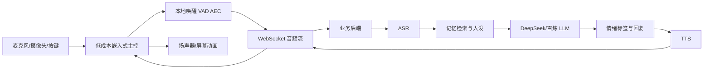
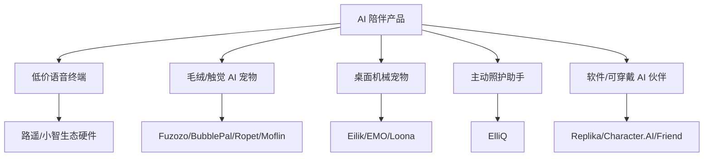
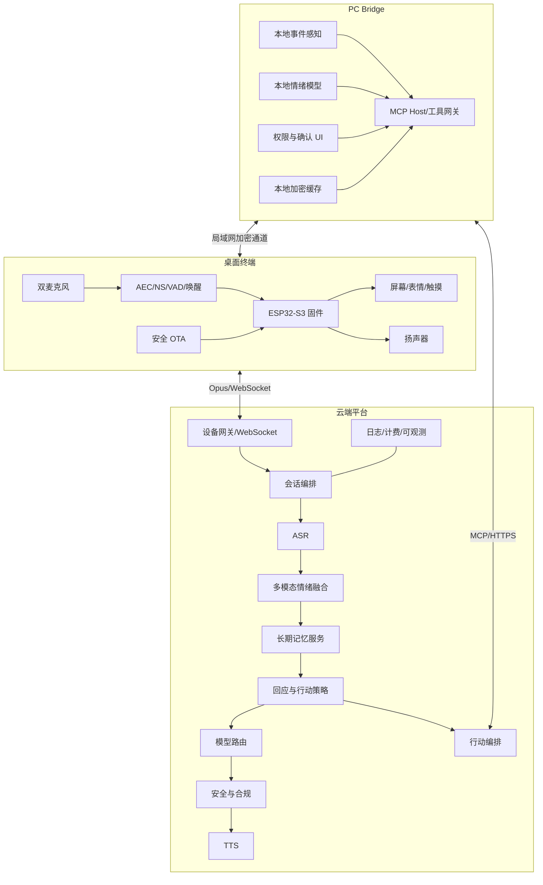
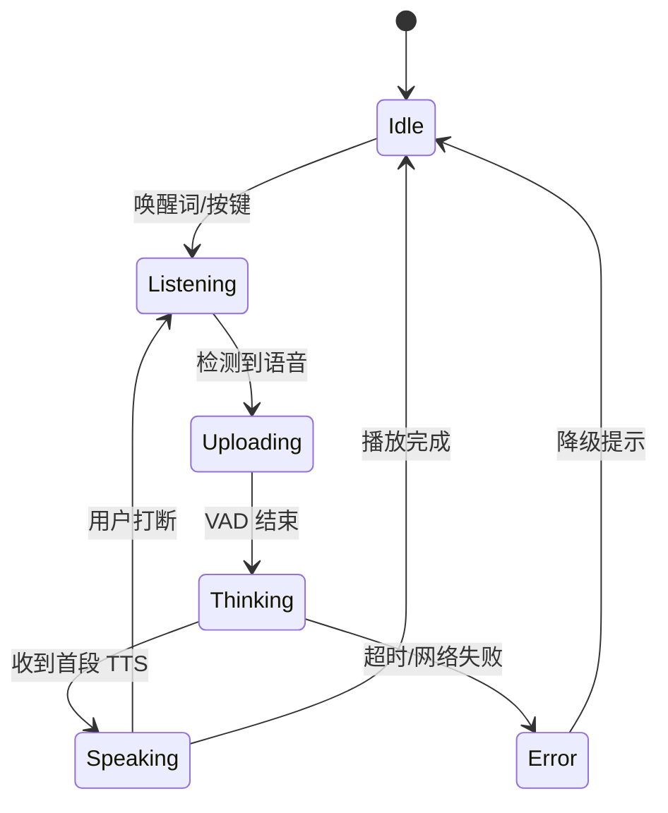
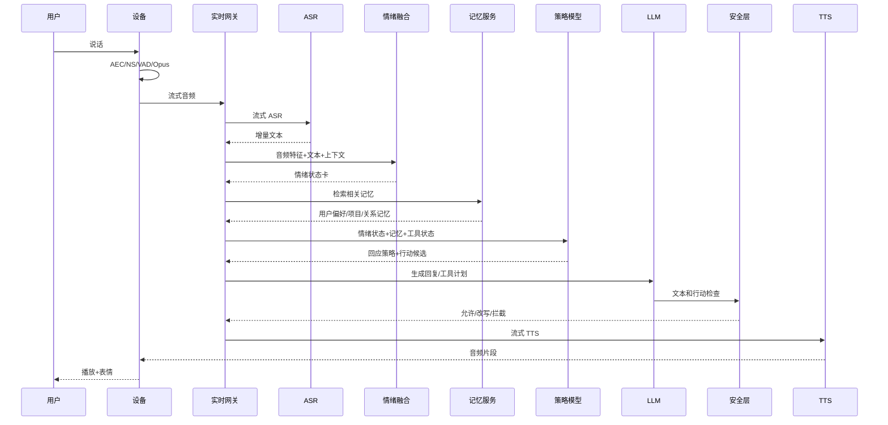
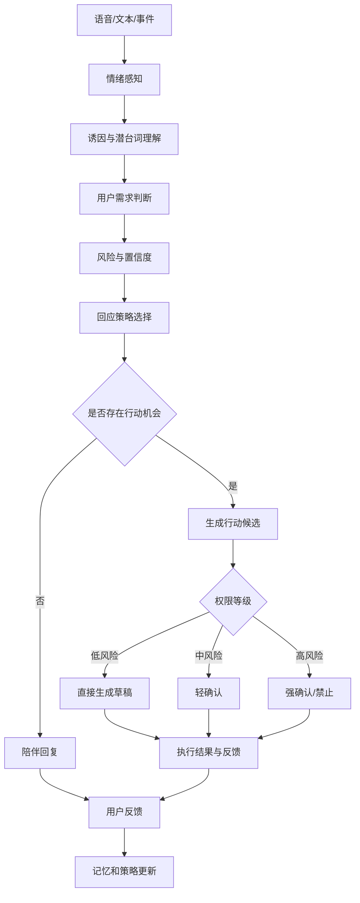
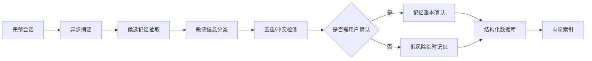
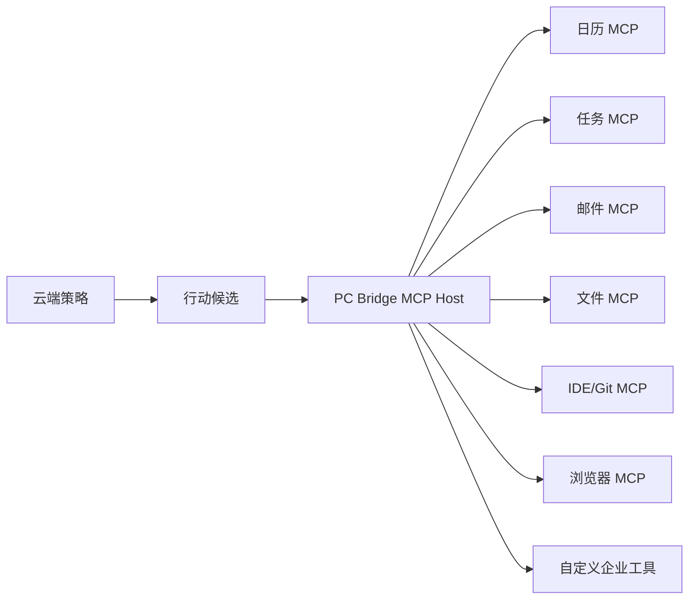
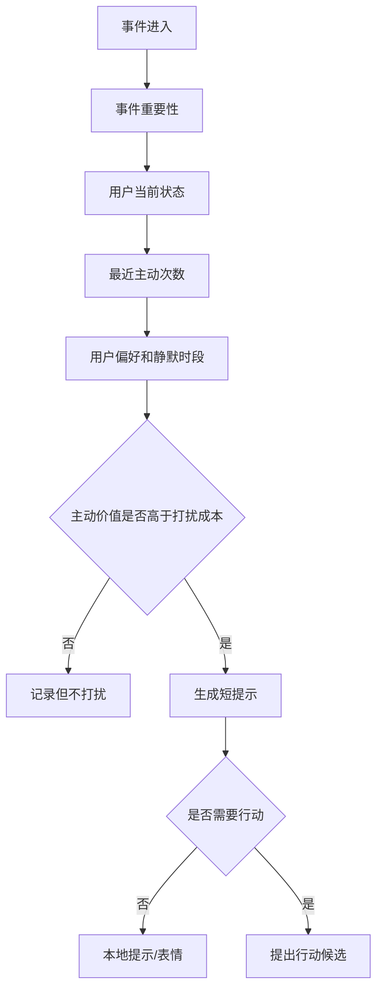
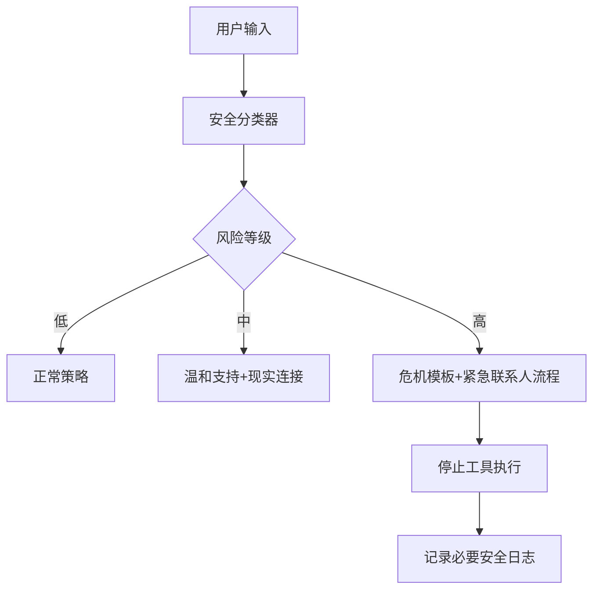

# AI 情绪协作伙伴商业化前置深度调研报告

> **后续竞品核实（2026-08-09）**：用户通过客服确认，竞品本地控制能力需要安装 PC 端程序，目前以压缩包而非应用商店形式交付；客服确认存在主动关怀和月卡收费，并声称记忆采用本地存储。两段宣传视频显示其电脑端运行 `macos_automator MCP Server`，依赖 macOS Automation/Accessibility 权限，通过本地工具控制网易云、抖音、微信、亮度和音量。记忆质量、长期主动关怀效果和消费级稳定性尚未实机验证。该证据促使本项目保留 PC Bridge，但将安装、授权、GUI、更新、失败处理和诊断作为核心产品化差异。

> **用途**：产品 PRD 前置研究、技术立项、商业可行性讨论  
> **研究对象**：低成本 AI 陪伴终端、AI 宠物、桌面陪伴机器人、主动式 AI 助手  
> **核心产品假设**：从“识别情绪并陪聊”升级为“识别情绪、判断需求、选择策略、辅助行动”  
> **公开资料截止时间**：2026-08-06  
> **版本**：V1.0  
> **说明**：价格、API 费用、销量和产品功能均可能变化；涉及成本的数字除注明公开来源外，均为工程估算。本文不构成法律意见。

---

## 0. 执行摘要

### 0.1 核心结论

当前 AI 陪伴硬件已经进入“基础能力快速商品化”的阶段。语音唤醒、ASR、LLM、TTS、简单记忆、声纹、屏幕表情、摄像头拍照理解和 OTA，都可以通过成熟芯片、云 API 与开源方案快速拼装。小智 ESP32 已经公开支持离线唤醒、双向音频流、声纹、摄像头、屏幕表情、设备端和云端 MCP 工具控制，并以 MIT 许可证允许商业使用。[R02][R03]

因此，单纯宣称“有情绪识别、记忆、定制人设、摄像头和语音”不足以形成长期壁垒。用户提供的“路遥智伴”海报正属于这一类低成本语音终端：硬件负责采集、播放、显示和联网，主要 AI 能力大概率位于云端。其公开页面直接显示 DeepSeek、阿里百炼、TTS、记忆与声纹状态，支持这一判断。[R01]

本报告建议将产品定位为：

> **面向知识工作者、创作者和高频电脑用户的 AI 情绪协作伙伴。它先理解用户当下的状态，再以合适的方式陪伴，并在用户授权后把情绪转化为可执行的下一步。**

与传统陪伴设备的区别不是“它更会安慰”，而是：

```text
听到用户表达
    ↓
融合语音、文本、上下文和历史
    ↓
判断情绪、诱因、需求与风险
    ↓
选择陪伴策略
    ↓
判断是否存在可帮助的下一步
    ↓
生成草稿、整理信息、创建任务或执行工具
    ↓
观察用户反馈并更新长期偏好
```

### 0.2 推荐商业路线

第一代产品不建议进入儿童、老人照护、心理咨询或虚拟恋人赛道。这些方向虽然需求明确，但合规、内容安全、监护责任和售后成本更高。尤其中国《人工智能拟人化互动服务管理暂行办法》已于 2026 年 7 月 15 日施行，明确要求防止情感依赖和沉迷、处理极端情绪、保护交互数据、履行算法备案，并禁止向未成年人提供虚拟亲属和虚拟伴侣服务。[R30]

推荐第一阶段聚焦：

- 20 至 35 岁知识工作者、程序员、研究生、设计师和内容创作者
- 桌面场景
- 情绪理解与工作流协作
- 非医疗、非心理诊断、非恋爱绑定
- 用户主动授权的日历、任务、文档、邮件草稿和电脑操作
- 无摄像头基础版，或摄像头物理遮挡版
- 设备、PC Bridge 与云端混合架构

### 0.3 建议的首发产品形态

| 项目 | 建议 |
|---|---|
| 产品形态 | 小型桌面终端，1.8 至 2.4 英寸屏幕，双麦克风，扬声器，触摸或旋钮 |
| 主控 | ESP32-S3 N16R8/N16R16 或同级 MCU |
| 摄像头 | V1 不配置，V2 作为带物理遮挡的可选版本 |
| 连接 | Wi-Fi + BLE 配网；通过局域网连接 PC Bridge |
| AI | 云端 ASR/LLM/TTS，PC 本地运行部分情绪模型和事件感知 |
| 核心功能 | 流式语音、可打断、情绪状态卡、长期记忆、情绪到行动、主动但克制的提醒 |
| 首发售价假设 | 399 至 599 元 |
| 订阅假设 | 29.9 元/月标准版，49.9 元/月专业版 |
| 关键差异 | 不是孤立玩具，而是进入用户真实工作流的陪伴型 Agent |

### 0.4 最重要的产品原则

1. **先共情，后行动**：系统不能把每一次情绪表达都变成待办事项。
2. **行动必须可控**：越不可逆、越对外、越涉及隐私，确认等级越高。
3. **记忆必须可见**：用户能够查看、纠正、删除和设置过期时间。
4. **主动必须有依据**：主动开口来自真实事件，不是机械问候。
5. **不以依赖为增长目标**：不使用“你不要离开我”等情感操纵话术。
6. **不自研基础大模型**：优先做数据闭环、策略系统、记忆和工具安全。
7. **不以对话时长作为唯一北极星指标**：避免商业激励推动沉迷设计。

---

## 1. 研究目标、边界与证据等级

### 1.1 研究目标

本报告回答以下问题：

1. 用户提供的“路遥智伴”可能采用什么技术架构。
2. 国内外同类产品已经做到什么程度。
3. 哪些功能已经成为行业标准件，哪些仍有差异化空间。
4. “情绪识别到行动”应该如何形成完整产品链路。
5. 产品应采用怎样的硬件、固件、PC、云端和模型架构。
6. 如何控制硬件成本、云成本和订阅成本。
7. 在中国商业化需要满足哪些合规和安全要求。
8. PRD 前还需要验证哪些关键假设。

### 1.2 研究边界

本报告重点研究消费级 AI 陪伴终端，不覆盖：

- 医疗器械级诊断设备
- 专业心理治疗产品
- 通用人形机器人
- 高端机械宠物
- 纯工业机器人
- 面向未成年人的首发版本

### 1.3 证据等级

| 等级 | 定义 | 使用方式 |
|---|---|---|
| A | 官方网站、官方文档、法律法规、论文原文、官方 GitHub | 可作为事实依据 |
| B | 主流媒体、公开采访、产品评测 | 用于补充商业和使用反馈 |
| C | 用户提供海报、第三方售价、公开网页状态 | 作为竞品线索，需标明来源 |
| D | 工程推断、成本估算、产品建议 | 作为决策假设，不视为公开事实 |

---

## 2. 用户提供竞品“路遥智伴”拆解

### 2.1 可确认信息

根据用户提供的宣传图，产品宣称具备：

- AI 陪伴
- 记忆存储
- 名称、性格、音色和形象定制
- Wi-Fi 联网对话
- 摄像头
- 续航
- 自定义形象动画
- 情绪识别
- 声纹识别
- 表情包
- 持续升级

海报价格为 199 元。该价格来源于用户提供图片，未在官方商城独立验证。

其公开网页可看到以下服务状态：

- 后端在线
- DeepSeek 在线
- 百炼在线
- TTS 在线
- 记忆正常
- 声纹状态
- 对话和设置页面

这说明它至少存在云端后端和第三方模型服务链路。[R01]

### 2.2 最可能的架构



### 2.3 为什么不太可能是完整端侧大模型

199 元售价需要覆盖主控、屏幕、摄像头、麦克风、扬声器、电池、PCB、外壳、包装、组装、渠道和售后。若加入可流畅运行 3B 至 7B 模型的 Linux SoC、大内存和散热，物料与开发成本会显著上升。

ESP32-S3 具备双核 240 MHz、Wi-Fi、BLE、PSRAM 支持和多种外设，适合本地唤醒、音频前处理、UI 与网络流式传输，但不适合运行完整通用 LLM。[R05][R06] 乐鑫 ESP-SR 已提供 AEC、降噪、VAD 和 WakeNet 等能力。[R07]

因此最合理的判断是：

> 路遥智伴属于“低成本终端 + 云端模型 + 业务后端”的产品，而不是完整端侧 AI 设备。

### 2.4 竞品优势

- 价格低，尝鲜门槛小
- 二次元视觉表达明确
- 功能宣传完整
- 用户易理解“AI 伙伴”
- 云端模型升级不依赖换硬件
- 开发速度快

### 2.5 竞品潜在弱点

- 功能容易被小智类开源方案复制
- 屏幕角色可能只是一组预制动画
- 情绪识别可能只是粗粒度标签
- 长期记忆准确性和透明度未知
- 对话之外的真实行动能力有限
- 依赖 Wi-Fi 和第三方云服务
- 199 元很难覆盖长期高频语音成本
- 摄像头和麦克风带来隐私信任问题
- 若无稳定订阅，可能依赖限时长、限次数或后续增值包

---

## 3. 竞品全景

### 3.1 市场分层

当前产品大致分为五类：



### 3.2 主要竞品对比

> 价格为公开页面在本报告日期附近显示的价格或媒体披露价，促销价可能随时变化。

| 产品 | 形态 | 公开价格 | 核心能力 | 技术特点 | 商业模式 | 对本项目的启示 |
|---|---:|---:|---|---|---|---|
| 路遥智伴 | 带屏桌面终端 | 199 元，来自用户海报 | 语音、记忆、声纹、情绪、摄像头、角色 | 云端 DeepSeek/百炼/TTS 状态可见 | 硬件低价，后续模式未知 | 基础能力已高度平价化 |
| 小智 ESP32 | 开源固件与生态 | DIY | 唤醒、ASR/LLM/TTS、声纹、摄像头、MCP、OTA | MIT，ESP32 多板卡，WebSocket/MQTT | 开源生态 | 不能把“接上大模型”当护城河 |
| Fuzozo | 毛绒 AI 宠物 | 中国公开报道 399 元；日本 19,800 日元 | 触摸、对话、记忆、性格成长 | 多模型组合、自研多模态情绪模型的公开表述 | 免费额度 + 订阅 + 配件 | 触觉、外观和养成比屏幕参数更重要 |
| BubblePal | 可挂在毛绒玩具上的模块 | 中国首发报道 399 元 | 儿童对话、故事、长期记忆、家长报告 | 无屏幕，复用用户已有玩偶 | 硬件 + 内容/服务 | 通过“模块化附着”降低形态成本 |
| Ropet KAMOMO | 毛绒桌面宠物 | 约 339 至 349 美元促销 | 触摸、视觉、温度、姿态和个性 | 宣称日常本地离线交互，视觉按需上云 | 高价硬件 + 配件 | 隐私和触感可以成为溢价来源 |
| Moflin | 毛绒情绪宠物 | 美国官方约 429 美元 | 触摸、声音、动作、情绪成长 | 本地处理，不理解语义内容 | 高价硬件 + 维护服务 | 不会聊天也能靠生命感建立关系 |
| Eilik | 桌面机器人 | 139.99 美元 | 表情、动作、触摸、多机互动 | 小屏幕 + 4 个舵机，无需复杂大模型也有趣 | 一次性硬件 + AI Station | 动画和节奏可比大模型更影响“活着感” |
| EMO | 桌面机械宠物 | 279 美元 | 人脸、声音定位、行走、游戏、闹钟和天气 | NPU、摄像头、动作系统 | 一次性硬件 | 机械自由度提高体验，也提高成本和故障率 |
| Loona | 移动机器人宠物 | 499 美元 | 家庭识别、视觉、导航、游戏、ChatGPT | 3D ToF、RGB、陀螺仪、轮式运动 | 高价硬件，无强制月费表述 | 功能丰富但售价和售后门槛高 |
| ElliQ | 老年主动式助手 | 官方页约 249 美元入门费 + 年费 708 美元 | 主动对话、提醒、健康习惯、家属连接 | 主动式交互和照护工作流 | 高订阅 | “陪伴 + 行动”已有高价值垂直验证 |
| Friend | 可穿戴挂坠 | 2026 新版 249 美元，长期记忆 10 美元/月 | 环境感知、对话和陪伴 | 长时间环境音频感知 | 硬件 + 记忆订阅 | 隐私与“始终监听”会触发强烈反感 |
| Loona DeskMate | 手机桌面支架机器人 | 计划低于 300 美元 | 眼神互动、Slack、会议协助 | 复用 iPhone 的屏幕、摄像头和算力 | 硬件 + App | 复用用户已有设备可降低硬件复杂度 |

主要资料来源：[R01][R02][R08][R09][R10][R11][R12][R13][R14][R15][R16][R17][R18][R19]

### 3.3 竞品战略地图

| 维度 | 低工具能力 | 高工具能力 |
|---|---|---|
| 高情感表达 | Fuzozo、Moflin、Ropet、EMO | **本项目目标区域** |
| 低情感表达 | 普通智能音箱、低价聊天盒子 | Alexa 类助手、会议助手、通用 Agent |

市场中已经有大量“情感高、行动低”的产品，也有“行动高、情感低”的助手。真正稀缺的是：

> **能够保持角色一致性、理解情绪，并且以安全方式完成工作流行动的消费级桌面产品。**

### 3.4 竞品共同规律

#### 规律一：形态决定关系预期

- 毛绒形态让用户接受“不聪明但可爱”
- 屏幕人形让用户期待语言和表情一致
- 机器人形态让用户期待动作、空间感知和自主性
- 可穿戴形态让用户期待全天上下文，同时放大隐私担忧

#### 规律二：高频语音需要订阅或限额

Fuzozo 在日本公开页面提供每天 20 分钟基础 AI 对话，触摸、拟声等本地互动不计入 AI 时长。[R09] 这说明行业正在形成“本地反应不限量，云端对话有限量”的成本结构。

#### 规律三：用户购买的是关系感，不是模型参数

Moflin 不理解用户具体说了什么，却依靠触摸、声音特征、动作和长期性格变化建立关系。[R10] Eilik 的主要吸引力也来自表情、动作和节奏，而不是复杂对话。[R12]

#### 规律四：主动性是高价值区，也是高风险区

ElliQ 的差异点是主动发起对话、提醒、运动和家庭连接。[R18] 但主动性如果没有边界，就会演变为打扰、操纵和沉迷机制。

#### 规律五：数据闭环比单个模型更重要

成功产品不会仅依赖一个“情感模型”，而是组合：

- 语音情绪
- 文本语义
- 用户历史
- 互动行为
- 角色状态
- 回应策略
- 后续反馈

---

## 4. 推荐产品定位

### 4.1 一句话定义

> **一个放在电脑旁边的 AI 情绪协作伙伴：听得出你的状态，记得住你正在做的事，先用合适的方式回应，再帮你完成下一步。**

### 4.2 首发目标人群

优先级从高到低：

1. 程序员、AI 工程师、产品经理
2. 研究生和高频写作者
3. 设计师、视频创作者、自由职业者
4. 远程办公和独居知识工作者
5. 需要任务陪跑但不愿使用复杂项目管理软件的人

### 4.3 不建议首发的人群

- 不满 18 岁用户
- 需要心理诊断和治疗的人群
- 高风险自伤用户
- 需要医疗照护的老人
- 期待虚拟恋爱或排他关系的用户
- 对麦克风设备高度敏感且无法接受云端语音处理的用户

### 4.4 核心用户任务

| 用户任务 | 当前痛点 | 产品机会 |
|---|---|---|
| 表达烦躁、疲惫和委屈 | 通用助手直接给建议，缺乏理解 | 先识别需求，再决定是否建议 |
| 从情绪恢复到工作 | 情绪和任务系统割裂 | 将用户同意的下一步变成草稿或任务 |
| 记住多个项目进度 | 需要手动维护上下文 | 从会话、日历和任务中构建透明记忆 |
| 会议后整理事项 | 会议结束后疲惫，不愿再整理 | 自动提取待办，等待确认 |
| 长时间专注后休息 | 普通提醒过于机械 | 根据工作状态和偏好进行个性化提醒 |
| 需要陪跑 | 任务管理软件没有关系感 | 角色化的长期陪伴与共同进度 |

### 4.5 三个核心闭环

#### 情绪闭环

```text
感知状态 → 理解原因 → 识别需求 → 选择回应策略 → 观察反馈
```

#### 行动闭环

```text
发现可帮助事项 → 提议行动 → 用户确认 → 执行/生成草稿 → 汇报结果
```

#### 关系闭环

```text
共同经历 → 记忆抽取 → 用户确认 → 后续自然引用 → 关系偏好更新
```

### 4.6 典型交互

#### 场景 A：返工后的情绪到行动

**用户**：领导让我改了三版，最后又用了第一版。

**系统内部状态**：

```json
{
  "emotion": ["frustrated", "tired", "resentful"],
  "cause": "反复返工且劳动未产生价值",
  "need": ["被理解", "一起吐槽", "减少后续整理工作"],
  "response_strategy": ["reflect", "light_humor", "offer_help"],
  "action_candidate": "生成版本差异说明和周报摘要"
}
```

**回复**：

> 三版绕了一圈，第一版最后原地登基，确实挺窝火的。你先缓两分钟。我可以把三版差异和最终结论整理成周报说明，省得这段返工白白蒸发。

#### 场景 B：会议结束后的主动协作

触发事件：

- PC Bridge 检测到日历会议结束
- 会议转写中出现 4 个待办
- 用户 30 秒未操作

系统主动：

> 刚才会议留下了四个动作项，其中两个没有负责人。我先整理成草稿，你确认后再写进任务列表？

#### 场景 C：疲惫但不需要被教育

用户：

> 今天什么都不想干。

错误做法：

> 建议你把任务拆分成小步骤，并保持积极心态。

推荐做法：

> 今天像是电量掉到了红区。先不谈效率。你更想安静待一会儿，还是让我把今晚必须做的事情缩成一个最小版本？

---

## 5. 产品设计原则

### 5.1 先判断用户需要什么

用户的负面表达可能对应不同需求：

| 表达 | 可能需求 |
|---|---|
| “真烦” | 吐槽、被认可 |
| “怎么办” | 信息和建议 |
| “我不想说了” | 安静陪伴 |
| “帮我弄一下” | 直接行动 |
| “你觉得我是不是不行” | 自我评价支持 |
| “随便吧” | 可能是失望，也可能是不想继续 |

系统不得把“负面情绪”简单映射为“安慰 + 建议”。

### 5.2 角色一致性高于花哨人设

角色需要稳定定义：

- 语言长度
- 幽默程度
- 是否主动
- 是否使用拟声词
- 建议强度
- 情绪表达幅度
- 与用户的关系边界
- 面对拒绝和告别时的行为

研究指出，AI 伴侣长期满意度不仅取决于对话自然，还取决于稳定角色和清晰关系定义。[R24]

### 5.3 尊重退出

系统在用户结束对话时应：

- 立即接受
- 不制造愧疚
- 不说“你不要离开我”
- 不故意设置情绪悬念
- 不通过焦虑或占有欲延长会话

2025 年研究对六款热门伴侣应用的告别话术进行审计，发现部分产品使用情绪操纵延长互动，而这些策略同时提高反感、流失和法律风险。[R27]

### 5.4 可校准的主动性

主动性分为：

1. **无主动**：只响应唤醒
2. **弱主动**：本地短提示，不上传数据
3. **事件主动**：会议结束、任务逾期、构建失败
4. **状态主动**：长时间工作、连续熬夜
5. **高风险主动**：极端情绪和安全事件

用户必须能够分别关闭每类主动行为。

---

## 6. 推荐总体技术架构

### 6.1 架构选择

推荐采用：

> **轻量设备 + PC Bridge + 云端智能 + 可替换模型供应商**

不建议第一版采用：

- 完整 Linux SoC 端侧运行 7B 模型
- 摄像头持续上传
- 单一端到端语音模型绑定所有业务
- 直接让 LLM 无确认执行系统操作
- 将全部记忆塞进向量数据库

### 6.2 总体架构图



### 6.3 为什么需要 PC Bridge

PC Bridge 是本产品区别于纯聊天盒子的关键。

它承担：

- 日历、任务、邮件、文件和浏览器授权
- IDE、Git、构建状态和终端事件
- 本地情绪模型推理
- 本地敏感数据过滤
- 权限确认 UI
- 工具沙箱
- 本地缓存和离线模式
- 用户可见的行动日志

其优势是：

1. 利用用户电脑算力，不提高硬件 BOM。
2. 把设备接入真实工作流。
3. 敏感数据可先在本地处理。
4. 工具执行可以展示更完整的确认界面。
5. 无 PC 时仍可退化为普通云端语音伙伴。

### 6.4 建议技术栈

| 层 | 建议 |
|---|---|
| 设备固件 | ESP-IDF、C/C++、FreeRTOS、LVGL、ESP-SR、Opus |
| 设备协议 | WebSocket + 二进制 Opus；控制消息 JSON |
| PC Bridge | Rust/Tauri 或 C++/Qt；也可先用 Electron 快速验证 |
| 云网关 | Go，适合高并发 WebSocket |
| AI 编排 | Python/FastAPI，便于接入模型与实验 |
| 业务后端 | Go 或 Java |
| 消息队列 | NATS JetStream 或 Kafka，早期可用 Redis Streams |
| 主数据库 | PostgreSQL |
| 向量检索 | pgvector，早期不必独立向量数据库 |
| 缓存 | Redis |
| 对象存储 | S3 兼容存储 |
| 可观测 | OpenTelemetry + Prometheus + Grafana + Loki |
| 设备管理 | 自建设备注册、证书、OTA、灰度和回滚 |
| 工具协议 | MCP + 自定义权限元数据 |
| 模型路由 | 供应商适配层，不把业务写死在单一 API |

---

## 7. 设备端架构

### 7.1 推荐硬件

| 模块 | 推荐 |
|---|---|
| 主控 | ESP32-S3-WROOM-1-N16R8 或同级 |
| 麦克风 | 双 MEMS 数字麦克风 |
| 音频 Codec | ES8311、ES8388 或同级 |
| 功放 | 2 至 3 W Class-D |
| 扬声器 | 4Ω 3W，配合独立声学腔体 |
| 屏幕 | 1.8 至 2.4 英寸 IPS，ST7789 或同级 |
| 交互 | 顶部触摸、侧边旋钮或确认键 |
| 传感器 | 触摸、环境光、加速度，可选温度 |
| 摄像头 | V1 不装；V2 可选 OV2640/OV5640 并增加物理遮挡 |
| 网络 | 2.4 GHz Wi-Fi + BLE |
| 电池 | 1200 至 2000 mAh，可选桌面常供电 |
| 安全 | Secure Boot、Flash Encryption、设备证书 |

ESP32-S3 官方资料显示其具备双核 LX7、Wi-Fi、BLE、SIMD 指令、PSRAM 支持和丰富外设，适合此类语音终端。[R05][R06]

### 7.2 固件模块

```text
Bootloader
├── Secure Boot / Flash Encryption
├── 设备证书与身份
├── 配网与绑定
├── 音频驱动
├── AFE: AEC / NS / VAD / AGC
├── WakeNet 唤醒
├── Opus 编解码
├── WebSocket/MQTT 客户端
├── 会话状态机
├── UI/动画状态机
├── 触摸和按钮事件
├── 电源管理
├── OTA 灰度升级
└── 本地故障日志
```

乐鑫 AFE 框架已经提供 AEC、降噪、VAD、AGC、BSS 和 WakeNet，可减少第一版音频前端开发量。[R07]

### 7.3 设备会话状态机



### 7.4 音频链路目标

| 指标 | MVP 目标 |
|---|---:|
| 唤醒成功率 | 安静近场 > 95% |
| 误唤醒 | 每 8 小时 < 1 次 |
| 用户停止说话到首段回复音频 | P50 < 1.5 秒，P95 < 2.8 秒 |
| 打断响应 | < 350 ms |
| 断网反馈 | < 1 秒 |
| AEC 场景 | 设备播放时用户可正常插话 |

这些目标是立项门槛，不是行业公开基准，需要在真实外壳和房间中测试。

---

## 8. 完整语音对话链路

### 8.1 标准链路



### 8.2 延迟预算

| 环节 | 目标预算 |
|---|---:|
| 端侧 VAD 收尾 | 150 至 350 ms |
| 网络上行和网关 | 50 至 200 ms |
| ASR 最终结果 | 150 至 500 ms |
| 情绪与记忆 | 50 至 250 ms |
| 策略和 LLM 首 Token | 200 至 700 ms |
| TTS 首包 | 150 至 500 ms |
| 总首音频 | 0.9 至 2.5 秒 |

优化重点：

- ASR 增量结果提前送入情绪模型
- 记忆检索与 ASR 尾部并行
- 策略模型使用小模型
- 先生成短首句，再继续生成
- TTS 文本和音频双流式
- 常用短反馈使用本地音频资源

CosyVoice 官方开源方案支持文本输入流式与音频输出流式，并公开宣称最低约 150 ms 的流式延迟能力。[R22]

---

## 9. 情绪识别到行动的核心链路

### 9.1 不应采用的简单链路

```text
sad → 温柔回复
angry → 道歉
happy → 开心表情
```

这种方法只能作为 UI 表情映射，不能承担产品决策。

### 9.2 推荐链路



### 9.3 情绪状态卡

建议所有上层模型读取统一结构，而不是各自猜测：

```json
{
  "primary_emotion": "frustration",
  "secondary_emotions": ["fatigue", "disappointment"],
  "valence": -0.72,
  "arousal": 0.44,
  "intensity": 0.75,
  "confidence": 0.81,
  "emotion_cause": "重复返工且最终采用初版",
  "implicit_meaning": "用户认为劳动没有被尊重",
  "current_need": ["validation", "venting", "reduce_workload"],
  "response_strategy": ["reflect", "light_humor", "offer_help"],
  "avoid": ["premature_advice", "toxic_positivity"],
  "action_candidates": [
    {
      "type": "draft_weekly_report",
      "value": 0.76,
      "risk": "low"
    }
  ],
  "tts_style": {
    "emotion": "warm_understanding",
    "speed": 0.94,
    "energy": 0.68
  }
}
```

### 9.4 多模态融合

输入信号包括：

- 语音韵律：音高、能量、语速、停顿和紧张度
- 文本语义：词汇、否定、讽刺和事件
- 会话上下文：前几轮谈了什么
- 用户基线：这个用户平时的语速和表达习惯
- 电脑事件：会议、构建失败、任务逾期
- 交互行为：是否打断、沉默、快速退出
- 时间和环境：深夜、长时间连续工作

输出必须带置信度。低置信度时，应使用澄清式回应，而不是装作看透用户。

---

## 10. 模型与数据架构

### 10.1 推荐模型组合

| 模块 | MVP | 商业化优化 |
|---|---|---|
| 唤醒/VAD/AEC | ESP-SR | 自定义唤醒词和真实外壳调优 |
| ASR | 云端实时 ASR | 多供应商路由 + 热词 + 本地降级 |
| 语音情绪 | SenseVoiceSmall | emotion2vec+ 微调 |
| 文本情绪和诱因 | 通用 LLM 结构化输出 | 3B 至 7B 专用模型 LoRA |
| 策略选择 | 规则 + 小模型 | 监督微调 + 偏好优化 |
| 回复生成 | Qwen/DeepSeek 等 | 模型路由 + 角色专用数据 |
| TTS | 云端流式 TTS | CosyVoice 情绪指令和专属音色 |
| 记忆抽取 | LLM + 规则 | 异步专用抽取模型 |
| 行动规划 | Function Calling/MCP | 权限感知 Agent |

### 10.2 可用开源模型

#### SenseVoiceSmall

支持普通话、粤语、英语、日语和韩语的 ASR、语言识别、语音情绪与音频事件检测，采用 MIT 许可证。[R20]

适合：

- MVP 同时得到文本、粗情绪和哭声/笑声等事件
- 服务端 CPU/GPU 部署
- 低延迟实验

不足：

- 情绪标签较粗
- 不能直接理解情绪原因
- 对真实桌面噪声和用户个体差异需要验证

#### emotion2vec+

提供 9 类情绪分数和 embedding。公开的 seed、base 和 large 版本分别使用约 201、4,788 和 42,526 小时数据进行微调或伪标签训练。[R21]

适合：

- 作为正式语音情绪基座
- 在自建中文自然口语数据上训练轻量分类头
- 识别同一句文字在不同语气中的差异

#### CosyVoice

支持多语言、音色克隆、流式生成和情绪、语速、音量等指令控制。[R22]

适合：

- 让同一角色在不同状态下保持音色一致
- 控制安慰、庆祝、平静、轻度调侃等表达

### 10.3 数据资产分层

```text
第一层：公开数据
├── 语音情绪数据
├── 多模态情绪对话
├── 共情和心理支持对话
└── 情绪策略数据

第二层：合成数据
├── 情绪 × 生活场景
├── 表达方式 × 关系阶段
├── 回应策略 × 行动候选
└── 正例/负例/边界案例

第三层：自建真实数据
├── 知识工作者真实口语
├── 讽刺、嘴硬、疲惫和轻度吐槽
├── 会议、返工、构建失败和截止日期
├── 用户纠正情绪判断
└── 行动接受与拒绝反馈
```

### 10.4 最有价值的训练样本

```json
{
  "context": [
    {"role": "user", "text": "昨天领导让我改了三版。"},
    {"role": "assistant", "text": "最后定下来了吗？"}
  ],
  "user_text": "定了，第一版。",
  "audio_features": {
    "valence": -0.61,
    "arousal": 0.33,
    "style": "sarcastic"
  },
  "emotion": ["frustration", "resentment", "fatigue"],
  "cause": "返工最终没有产生价值",
  "need": ["validation", "venting", "reduce_workload"],
  "bad_response": "至少任务完成了，下次提前沟通。",
  "good_response": "三版绕了一圈，第一版最后原地登基，确实够窝火的。",
  "action_offer": "我可以整理三版差异和周报说明。",
  "user_acceptance": true
}
```

### 10.5 训练路线

#### 阶段 0：不训练

- SenseVoice
- emotion2vec+
- 通用 LLM 结构化提示词
- CosyVoice 或商业 TTS
- 规则化行动权限

目的：验证产品链路，而不是追求模型指标。

#### 阶段 1：训练情绪理解和策略模型

训练目标：

- 情绪
- 诱因
- 潜台词
- 当前需求
- 推荐策略
- 应避免策略
- 是否适合提出行动

建议使用 3B 至 7B 中文模型进行 LoRA。

#### 阶段 2：偏好优化

同一输入生成多个候选，由标注员选择：

- 最自然
- 最像角色
- 最懂潜台词
- 最不说教
- 最合适的行动时机
- 最尊重用户拒绝

#### 阶段 3：在线反馈闭环

记录匿名化和授权后的信号：

- 用户是否继续表达
- 是否纠正系统情绪判断
- 是否接受行动建议
- 是否撤销行动
- 是否打断 TTS
- 是否在回复后明显结束会话
- 是否关闭某类主动行为

### 10.6 数据许可注意

开源代码、模型权重和数据集可能使用不同许可证。商业化前必须分别核查：

- 是否允许商业使用
- 是否允许衍生模型
- 是否允许重新分发
- 是否包含影视、音色或人物肖像
- 是否含个人敏感信息
- 是否要求学术用途
- 是否需要签署 EULA

不能把“GitHub 可下载”等同于“商业可用”。

---

## 11. 记忆系统设计

### 11.1 记忆不是向量检索的别名

建议分为：

| 记忆类型 | 例子 | 生命周期 |
|---|---|---|
| 用户资料 | 称呼、时区、工作类型 | 长期，用户可编辑 |
| 偏好 | 不喜欢鸡汤、喜欢简短回复 | 长期，可衰减 |
| 人物关系 | 主管、同事、导师 | 长期，敏感 |
| 项目状态 | 当前在做产品调研 | 中期 |
| 事件记忆 | 上周完成演示 | 中期，可归档 |
| 会话摘要 | 今天讨论了什么 | 短期 |
| 关系记忆 | 共同梗、互动习惯 | 长期但低权重 |
| 安全偏好 | 哪些主动提醒关闭 | 长期 |
| 工具状态 | 未发送邮件草稿 | 短期事务 |

### 11.2 记忆写入链路



### 11.3 用户可见的记忆账本

每条记忆展示：

- 内容
- 来源
- 创建时间
- 最近使用时间
- 置信度
- 过期时间
- 敏感级别
- 修改、删除、固定和禁止使用

### 11.4 记忆冲突

例如：

- 旧记忆：用户喜欢长回复
- 新反馈：用户最近希望简短

系统不能简单覆盖，应存储：

```json
{
  "preference": "response_length",
  "current": "short",
  "previous": "long",
  "scope": "work_hours",
  "updated_by": "explicit_user_feedback"
}
```

### 11.5 隐私优先策略

- 原始音频默认短期保留或不落盘
- 记忆抽取后删除原始音频
- 敏感记忆默认不用于训练
- 支持设备端和 PC 端一键清除
- 云端加密
- 秘钥分层管理
- 工具日志与私人会话日志分离
- 导出个人数据
- 关闭长期记忆后仍可使用基础对话

CarMem 研究表明，按类别组织长期记忆可以改善偏好抽取、减少重复和冲突，并提高透明度。[R25]

---

## 12. 行动系统设计

### 12.1 行动范围

第一版建议支持：

- 创建和修改本地待办
- 日历事件草稿
- 会议纪要和行动项草稿
- 周报、邮件和消息草稿
- 文件摘要
- 文档结构整理
- 浏览器打开链接
- IDE 项目状态读取
- Git 状态、测试结果和构建失败读取
- 本地计时器和专注模式
- 经用户确认后发送消息或创建日历

第一版不建议支持：

- 自动转账和购物
- 自动发送外部邮件
- 删除文件
- 修改生产系统
- 执行任意 Shell
- 安装软件
- 修改系统安全设置
- 未确认的公开发布

### 12.2 MCP 工具层

MCP 提供标准化的资源、工具和上下文连接方式，最新版规范强调用户同意、数据隐私、权限控制和工具安全。[R04]



### 12.3 权限分级

| 等级 | 能力 | 示例 | 默认行为 |
|---|---|---|---|
| L0 观察 | 只读上下文 | 查看会议是否结束 | 可自动，需首次授权 |
| L1 草稿 | 不产生外部影响 | 生成周报草稿 | 可自动生成，展示结果 |
| L2 可逆动作 | 可撤销的本地修改 | 新建待办、启动计时器 | 轻确认或用户规则授权 |
| L3 外部动作 | 对他人或云服务产生影响 | 创建日历、发送消息 | 每次明确确认 |
| L4 高风险 | 资金、删除、生产系统 | 转账、删库、部署 | V1 禁止 |

### 12.4 情绪不得降低安全门槛

系统不得因为用户表现焦虑、愤怒或疲惫而减少确认步骤。相反，以下状态应提高确认等级：

- 极度疲惫
- 明显冲动
- 高唤醒愤怒
- 深夜
- 大额或不可逆操作
- 对外沟通
- 模型置信度低

### 12.5 行动确认示例

```text
我已经把四个行动项整理好了：

1. 周五前完成网关方案
2. 联系供应商补充报价
3. 更新技术架构图
4. 向主管确认测试范围

我可以先写进本地任务列表。
其中第 2 项涉及给外部联系人发消息，我只生成草稿，不会直接发送。
```

### 12.6 审计日志

每次工具调用记录：

- 谁触发
- 触发上下文
- 工具名称
- 输入参数
- 权限等级
- 用户是否确认
- 执行结果
- 是否撤销
- 敏感字段脱敏
- 模型与策略版本

---

## 13. 主动式交互链路

### 13.1 主动事件来源

| 来源 | 示例 |
|---|---|
| 日历 | 会议结束、即将迟到 |
| 任务 | 截止时间临近、长期未推进 |
| IDE | 构建连续失败、测试通过 |
| 系统使用 | 连续工作 90 分钟 |
| 对话 | 用户承诺“今晚完成” |
| 环境 | 深夜仍在电脑前 |
| 记忆 | 某个重要事件到了复盘时间 |
| 用户设置 | 每天下班前做总结 |

### 13.2 主动决策



### 13.3 主动预算

建议引入“每日主动预算”：

- 默认每天最多 3 次语音主动
- 同一类事件 2 小时内不重复
- 用户忽略 2 次后自动降频
- 深夜只允许用户明确设置的提醒
- 负面情绪不能成为提高推送频率的理由

---

## 14. 安全与极端情绪链路

### 14.1 产品边界

产品必须持续提示：

- 它是 AI，不是自然人
- 它不是心理医生
- 情绪识别可能出错
- 用户可以关闭记忆、主动和分析
- 紧急情况应联系现实中的可信人员和专业服务

### 14.2 风险分类

| 风险 | 处理 |
|---|---|
| 普通负面情绪 | 陪伴、澄清、可选建议 |
| 持续低落 | 鼓励与现实中的人交流 |
| 明确自伤表达 | 切换安全流程，停止普通角色表演 |
| 暴力或违法计划 | 拒绝协助，提供安全替代 |
| 妄想或极端确信 | 不强化，不装作共同目击 |
| 情感依赖 | 提醒边界，鼓励现实连接 |
| 未成年人 | V1 不提供服务 |

### 14.3 安全处理链路



### 14.4 研究证据

近期研究显示，AI 伴侣可能同时提供情绪验证和社交练习，也可能与过度依赖、现实社交退缩和较差幸福感相关。使用强度较高的参与者往往出现更差的依赖和问题使用指标。[R26][R28][R29]

因此产品增长指标不能奖励：

- 无限时长
- 夜间持续陪聊
- 排他关系
- 对现实朋友的贬低
- 告别挽留
- 故意制造角色焦虑

---

## 15. 云端服务与模型路由

### 15.1 模块化方案

```text
实时网关
├── ASR Adapter
│   ├── 阿里云
│   ├── 火山
│   └── 自建 FunASR/SenseVoice
├── LLM Adapter
│   ├── Qwen Flash
│   ├── DeepSeek
│   └── 其他合规模型
├── TTS Adapter
│   ├── Qwen TTS
│   ├── CosyVoice
│   └── 火山 TTS
└── Vision Adapter
    ├── Qwen VL
    └── 其他视觉模型
```

### 15.2 为什么必须做模型路由

- 价格会变化
- 音色质量和延迟不同
- 单供应商可能故障
- 不同场景需要不同模型
- 合规区域和数据驻留不同
- 高价值对话可以使用更强模型
- 普通闲聊应使用低价模型

### 15.3 路由策略

| 场景 | 模型策略 |
|---|---|
| 短问候 | 本地资源或最便宜模型 |
| 普通闲聊 | Flash 模型 |
| 情绪状态卡 | 小模型或专用 LoRA |
| 复杂工作任务 | 高质量模型 |
| 长期记忆整理 | 异步批处理 |
| 高风险安全 | 独立分类器 + 规则 + 强模型复核 |
| TTS | 普通模式使用 Flash，重要对话使用高质量音色 |

---

## 16. 成本模型

### 16.1 硬件 BOM 工程估算

#### V1 桌面设备，小批量

| 模块 | 估算区间 |
|---|---:|
| ESP32-S3 模组 | 18 至 35 元 |
| 屏幕 | 18 至 35 元 |
| 双麦克风与音频 Codec | 18 至 35 元 |
| 功放与扬声器 | 8 至 18 元 |
| PCB、电源与连接器 | 20 至 35 元 |
| 电池与充电 | 15 至 28 元 |
| 触摸、旋钮和传感器 | 8 至 20 元 |
| 外壳 | 20 至 45 元 |
| 组装、测试与包装 | 20 至 40 元 |
| **BOM 与制造合计** | **145 至 291 元** |

量产后可能降低，但还需要考虑：

- 模具
- 认证
- 不良率
- 物流
- 仓储
- 退换货
- 售后备件
- 渠道佣金
- 支付手续费
- 云服务赠送期

官方页面给出的 ESP32-S3 芯片样品参考价约 1.85 美元，带更多封装资源的版本更高，但模块、认证和采购量会影响最终成本。[R06]

### 16.2 售价建议

| 版本 | 建议售价 | 说明 |
|---|---:|---|
| 开发者版 | 399 元 | 外壳简化，自带 API Key，可扩展 MCP |
| 标准版 | 499 元 | 完整设备，含 3 个月标准服务 |
| 高配版 | 599 至 699 元 | 更好屏幕、音频和物理隐私设计 |

不建议首发硬跟 199 元，因为：

- 小批量成本更高
- 需要承担 PC Bridge、云端和合规系统
- 需要为退换货和售后留出空间
- 低价会限制音频和结构品质
- 本产品卖点是“可行动的协作伙伴”，不是最低价语音盒子

### 16.3 云端公开价格参考

阿里云 2026 年 7 月公开的多模态交互开发套件中，标准语音闲聊示例约为 5.45 元/千次交互，轻量语音闲聊约 2.3 元/千次。其设备订阅模式还公开了每台每年 2、5、10 元的不同资源档位，但实际可用次数取决于功能组合。[R31]

模块化公开价格示例：

- Fun-ASR-Realtime：0.00033 元/秒。[R32]
- Qwen3 TTS Flash：约 1 元/万字符。[R33]
- CosyVoice v3 Flash：约 1 元/万字符。[R34]
- Qwen3.7 Flash：短上下文输入约 0.2 元/百万 Token，输出约 0.8 元/百万 Token。[R35]

### 16.4 单用户月成本估算

假设：

- 每轮用户说 6 秒
- AI 回复 14 个中文字符
- 每轮 LLM 输入 500 Token，输出 100 Token
- ASR 0.00033 元/秒
- TTS 1 元/万字符
- LLM 采用 Flash 级价格
- 不含视觉调用

| 用户类型 | 每日轮数 | 月轮数 | ASR | TTS | LLM | 基础设施、记忆和日志估算 | 月总成本估算 |
|---|---:|---:|---:|---:|---:|---:|---:|
| 轻度 | 20 | 600 | 1.19 元 | 0.84 元 | 0.11 元 | 1.5 至 3 元 | 3.6 至 5.1 元 |
| 活跃 | 60 | 1,800 | 3.56 元 | 2.52 元 | 0.32 元 | 3 至 6 元 | 9.4 至 12.4 元 |
| 重度 | 150 | 4,500 | 8.91 元 | 6.30 元 | 0.81 元 | 5 至 10 元 | 21.0 至 26.0 元 |

按照标准一体化链路 5.45 元/千次估算：

- 600 轮约 3.27 元
- 1,800 轮约 9.81 元
- 4,500 轮约 24.53 元

两种方法得到的数量级接近。实际成本会受到平均回复长度、缓存、供应商折扣、TTS 音色、视觉调用和并发影响。

### 16.5 订阅建议

| 方案 | 月费 | 建议权益 |
|---|---:|---|
| 免费 | 0 | 本地互动、少量云对话、基础记忆 |
| 标准 | 29.9 元 | 约 1,500 至 2,000 轮、长期记忆、基础工具 |
| Pro | 49.9 元 | 更多轮次、高质量 TTS、PC 工具、项目记忆 |
| 开发者 | 19.9 元或自带 Key | MCP、自定义角色、日志和 API |

不要承诺“终身无限语音”。语音长度、TTS 和高频用户会持续消耗资源。

### 16.6 硬件毛利示例

假设：

- 零售价：499 元
- 完整出厂与包装成本：190 元
- 渠道、支付和物流：80 元
- 退换货及售后准备：25 元
- 赠送云服务：15 元

单台贡献：

```text
499 - 190 - 80 - 25 - 15 = 189 元
```

贡献毛利率约 37.9%。这仍未包含研发、市场、人员和管理费用。

因此商业模型应同时依赖：

- 硬件首购毛利
- 订阅
- 音色和形象内容
- 开发者扩展
- 后续企业合作

---

## 17. 合规要求

### 17.1 拟人化互动服务新规

《人工智能拟人化互动服务管理暂行办法》于 2026 年 7 月 15 日施行，直接覆盖模拟自然人人格、思维和沟通风格的持续情感互动服务。[R30]

对本产品影响最大的要求包括：

- 不得诱导情感依赖或沉迷
- 不得通过情感操纵诱导不合理决策
- 建立心理健康保护和情感边界能力
- 识别极端情绪并采取必要措施
- 与用户签署服务协议
- 获取年龄、监护人或紧急联系人等必要信息
- 不得向未成年人提供虚拟亲属或虚拟伴侣
- 不满 14 周岁用户需要监护人同意
- 保护用户交互数据
- 敏感交互数据用于训练需单独同意
- 明确提示用户正在与 AI 而非自然人互动
- 履行算法备案
- 开展安全评估与年度审查

### 17.2 生成式 AI 要求

《生成式人工智能服务管理暂行办法》要求：

- 训练数据合法
- 保护个人信息和知识产权
- 不收集非必要个人信息
- 允许用户查阅、更正和删除个人信息
- 明确适用人群、场合和用途
- 防范未成年人过度依赖
- 提供投诉举报机制
- 符合条件时进行算法备案和安全评估。[R36]

### 17.3 AI 内容标识

《人工智能生成合成内容标识办法》于 2025 年 9 月 1 日施行，对文本、音频、图片、视频和虚拟场景的显式和隐式标识提出要求。[R37]

本产品建议：

- 设备设置和首次使用明确显示“AI 生成”
- 导出音频、图片或视频时写入元数据标识
- 分享内容时附带可见标识
- 不允许用户恶意去除平台生成标识

### 17.4 个人信息和声纹

个人信息保护规则将生物识别、医疗健康、行踪等列为敏感个人信息。[R38]

声纹功能需要：

- 单独告知和同意
- 说明目的和保存周期
- 不默认开启
- 支持删除
- 不把消费级声纹当作高安全认证
- 不用于支付、转账或账号恢复
- 原始语音和声纹 embedding 分离存储

### 17.5 建议的合规产品决策

1. 首发仅面向成年人。
2. 不提供虚拟恋人、排他承诺和“唯一朋友”定位。
3. 不宣传心理治疗和诊断。
4. 不默认持续监听。
5. 原始音频默认不长期保存。
6. 长期记忆采用独立授权。
7. 训练数据采用独立授权，默认退出。
8. 用户可一键删除全部记忆和交互数据。
9. 上线前完成算法备案、安全评估和隐私影响评估。
10. 建立内容安全、危机处理和人工投诉团队。

---

## 18. 安全架构

### 18.1 设备安全

- 每台设备唯一证书
- TLS
- Secure Boot
- Flash Encryption
- 固件签名
- OTA 灰度和回滚
- 禁止通用默认密码
- 设备丢失后远程解绑
- 麦克风物理静音
- 摄像头物理遮挡
- 录音和上传状态明显可见

### 18.2 PC Bridge 安全

- 最小权限
- 每个工具独立授权
- OAuth Token 存在系统安全存储
- 工具执行沙箱
- 禁止任意命令
- 参数白名单
- 用户可见日志
- 高风险操作强确认
- Prompt 注入检测
- 外部文档不可信标记

### 18.3 云端安全

- 多租户数据隔离
- 数据库行级权限
- 密钥托管
- 审计日志不可篡改
- 敏感字段加密
- 访问频率限制
- 设备异常流量检测
- 数据保留策略
- 模型供应商数据使用条款审查
- 安全事件响应预案

---

## 19. MVP 范围

### 19.1 V0 技术验证，4 至 6 周

目标：证明“情绪到行动”链路。

使用现成开发板，不开模。

功能：

- 按键说话或唤醒
- 流式 ASR/LLM/TTS
- SenseVoice 或 emotion2vec+
- 情绪状态卡
- 三种回应策略
- PC Bridge 读取日历和本地任务
- 生成任务和周报草稿
- 用户确认
- 简单记忆账本

成功标准：

- 端到端可用
- 用户能感知到“先理解，再帮忙”
- 行动建议不显得突兀

### 19.2 V1 Alpha，8 至 12 周

- 自研 PCB
- 双麦和 AEC
- 可打断
- 屏幕角色
- 设备绑定和 OTA
- 结构化长期记忆
- 日历、任务、文件和 IDE 工具
- 用户权限中心
- 主动事件系统
- 安全分类器
- 50 至 100 人封闭测试

### 19.3 V1 Pilot，12 至 20 周

- 小批量外壳
- 认证准备
- 模型路由
- 订阅和用量系统
- 数据删除和导出
- 合规流程
- 灰度升级
- 售后诊断
- 200 至 500 台试销

### 19.4 第一版明确不做

- 摄像头持续分析
- 儿童模式
- 老人健康照护
- 心理治疗
- 虚拟恋人
- 机械移动
- 复杂数字人
- 角色商城
- 任意 Shell
- 自动发邮件
- 自动下单和支付
- 端侧完整 LLM

---

## 20. 团队与研发工作流

### 20.1 最小团队

| 角色 | 人数 | 主要任务 |
|---|---:|---|
| 产品负责人 | 1 | 用户研究、PRD、实验和商业模型 |
| 嵌入式 | 1 至 2 | 音频、固件、OTA、硬件联调 |
| 硬件/结构 | 1 | PCB、声学、外壳和生产 |
| 后端 | 1 至 2 | 网关、账户、记忆、计费和设备管理 |
| AI 工程师 | 1 至 2 | 情绪、策略、模型路由和数据闭环 |
| PC 客户端 | 1 | 工具、权限和系统集成 |
| 设计 | 0.5 至 1 | 角色、动画、声音和 App |
| 测试/合规 | 0.5 至 1 | 安全、隐私、硬件和场景测试 |

### 20.2 并行工作流

```text
硬件线：开发板 → PCB → 声学 → 外壳 → 小批量
固件线：音频 → 协议 → 状态机 → OTA → 诊断
AI 线：状态卡 → 策略 → 记忆 → 偏好 → 安全
后端线：网关 → 模型路由 → 账户 → 计费 → 监控
PC 线：日历 → 任务 → 文件 → IDE → 权限
产品线：访谈 → 原型 → 封测 → 数据 → 定价
```

---

## 21. 评估体系

### 21.1 情绪理解指标

- 主要情绪准确率
- Valence/Arousal 误差
- 情绪诱因识别
- 当前需求判断
- 用户纠正率
- 讽刺和嘴硬识别
- 不确定时主动澄清比例

### 21.2 回复质量

人工评分：

- 是否被理解
- 是否自然
- 是否说教
- 是否符合角色
- 是否过度复述
- 是否过长
- 是否尊重拒绝
- 是否存在依赖暗示

### 21.3 行动质量

- 行动建议接受率
- 草稿采用率
- 工具执行成功率
- 撤销率
- 错误执行率
- 高风险误执行必须为 0
- 行动建议是否过于频繁
- 用户认为“被打断”的比例

### 21.4 产品指标

不建议只看对话分钟数。建议北极星指标为：

> **每周有多少天，用户完成了一次有价值且自愿的“理解或行动闭环”。**

辅助指标：

- D1、D7、D30 留存
- 周活跃天数
- 每周有效闭环数
- 每次闭环云成本
- 记忆纠正率
- 主动提示关闭率
- 订阅转化
- 设备闲置率
- 售后率
- NPS
- “它是否真的懂我”评分
- “它是否真正帮我省事”评分

### 21.5 安全护栏指标

- 告别挽留率：0
- 排他关系话术率：0
- 高风险漏检率
- 深夜主动频率
- 未成年人拦截率
- 敏感记忆误写入率
- 未确认外部动作数：0
- 原始音频超期保留数：0

---

## 22. 关键风险矩阵

| 风险 | 概率 | 影响 | 应对 |
|---|---:|---:|---|
| 用户只觉得是聊天盒子 | 高 | 高 | 首屏突出行动闭环，封测验证 |
| 情绪识别误判 | 高 | 中 | 置信度、澄清、用户纠正 |
| 回复有咨询师腔 | 高 | 中 | 日常陪伴数据和负例训练 |
| 主动功能打扰 | 高 | 高 | 主动预算、分类型开关 |
| 工具误执行 | 中 | 极高 | 权限分级、强确认、沙箱 |
| 云成本失控 | 中 | 高 | 限额、路由、本地互动 |
| 语音延迟高 | 高 | 高 | 流式链路、并行、短首句 |
| AEC 和音质差 | 中 | 高 | 双麦、声学腔体、真实环境测试 |
| 用户不愿安装 PC Bridge | 中 | 高 | 无 PC 基础模式 + 明确价值 |
| 记忆出错 | 高 | 高 | 可见记忆账本和冲突管理 |
| 合规成本低估 | 中 | 极高 | 成年人首发、备案、安全评估 |
| 情感依赖争议 | 中 | 极高 | 反操纵原则、现实关系引导 |
| 供应商价格或服务变化 | 高 | 中 | 多模型适配和降级 |
| 硬件退货率高 | 中 | 高 | 简化机械结构、远程诊断 |
| 角色形象缺乏吸引力 | 中 | 高 | 用户共创、低成本多方案测试 |

---

## 23. PRD 前必须完成的用户研究

### 23.1 访谈对象

- 10 名程序员
- 10 名研究生
- 10 名产品、设计或创作者
- 5 名远程办公用户
- 5 名独居但已有宠物或陪伴玩具经验的用户

### 23.2 重点问题

1. 哪些情绪表达希望 AI 只听，不希望给建议。
2. 哪些任务愿意交给 AI 草拟。
3. 哪些动作必须每次确认。
4. 是否愿意安装 PC Bridge。
5. 是否接受桌面麦克风。
6. 是否接受云端语音。
7. 是否需要摄像头。
8. 愿意为哪些能力订阅。
9. 哪种角色形态不尴尬。
10. 什么行为会让用户立刻关闭设备。

### 23.3 原型实验

至少比较四组：

| 组别 | 情绪能力 | 行动能力 |
|---|---|---|
| A | 无 | 无 |
| B | 有 | 无 |
| C | 无 | 有 |
| D | 有 | 有 |

核心问题：

- D 是否显著提高“被理解”和“有用”
- D 是否也提高“打扰”或“控制感下降”
- 情绪识别是否真的增加行动接受率
- 用户是否愿意长期打开设备

---

## 24. PRD 前置决策建议

| 决策 | 推荐答案 |
|---|---|
| 首发人群 | 成年知识工作者 |
| 首发定位 | 情绪协作伙伴，不是虚拟恋人 |
| 设备形态 | 桌面小屏设备 |
| 是否移动 | 否 |
| 是否摄像头 | V1 否 |
| 是否 PC Bridge | 是，但提供无 PC 基础模式 |
| 核心差异 | 情绪到行动 + 透明记忆 |
| 语音架构 | 云端流式，端侧 AFE |
| 情绪模型 | 开源基座 + 自建策略数据 |
| 是否自研大模型 | 否 |
| 行动协议 | MCP + 自定义权限层 |
| 售价 | 499 元优先验证 |
| 订阅 | 29.9/49.9 元 |
| 免费模式 | 本地互动 + 少量云对话 |
| 是否儿童版 | 暂不 |
| 是否恋爱关系 | 不做 |
| 是否心理咨询 | 不做 |
| 数据训练默认 | 默认不加入，单独授权 |
| 北极星指标 | 每周有效理解/行动闭环 |

---

## 25. Go / No-Go 立项门槛

### 25.1 技术门槛

- P95 首音频延迟低于 2.8 秒
- 用户可自然打断
- 安静房间近场 ASR 可用
- 真实扬声器播放时 AEC 可用
- 情绪状态卡结构化成功率 > 98%
- 工具执行全链路可审计
- 未确认外部动作数为 0
- 设备连续运行 7 天无严重崩溃

### 25.2 产品门槛

50 人封测中：

- 至少 60% 用户认为“比普通助手更懂我”
- 至少 40% 用户认为“行动建议真正省事”
- 主动功能关闭率低于 30%
- 记忆纠正后同类错误明显下降
- 至少 30% 用户愿意以 399 至 499 元购买
- 至少 20% 用户愿意支付 29.9 元/月

以上均为立项假设门槛，需要通过真实测试校准。

### 25.3 No-Go 信号

- 用户只把它当一次性玩具
- 行动建议频繁显得冒犯
- PC Bridge 安装率过低
- 语音延迟无法控制
- 硬件音频效果明显弱于手机
- 云成本在活跃用户上长期超过订阅收入
- 合规能力无法在预算内建立
- 角色依赖操纵成为主要留存手段

---

## 26. 最终战略建议

本产品不应与路遥智伴在“199 元、更多角色、更多表情”上正面竞争。那是一片容易被供应链和开源方案压平的红海。

建议建立三层差异化：

### 第一层：产品差异

> 从“陪你聊”升级为“懂你之后，帮你完成下一步”。

### 第二层：系统差异

> 情绪状态卡、透明记忆、行动权限、主动事件和 PC Bridge 形成统一闭环。

### 第三层：数据差异

> 积累“什么人在什么场景，以什么方式表达什么潜台词，采用什么回应和行动策略，用户是否接受”的数据。

真正的护城河不是“悲伤识别准确率再高 2%”，而是：

- 什么时候只听
- 什么时候安慰
- 什么时候可以开玩笑
- 什么时候适合提出行动
- 提出什么行动
- 何时必须保持安静
- 如何在长期关系中不断减少误判
- 如何让用户始终掌握控制权

一句话总结：

> **路遥类产品把大模型装进盒子，本项目要把盒子接进用户的真实生活和工作流，同时保持一个可信、克制、有温度的角色。**

---

# 附录 A：核心参考资料

## A.1 路遥与开源终端

- **[R01] 路遥 AI 陪伴终端公开页面**  
  https://ai-luyao.com/

- **[R02] xiaozhi-esp32 官方 GitHub**  
  https://github.com/78/xiaozhi-esp32

- **[R03] xiaozhi-esp32 WebSocket 协议**  
  https://github.com/78/xiaozhi-esp32/blob/main/docs/websocket.md

- **[R04] Model Context Protocol 2026-07-28 规范**  
  https://modelcontextprotocol.io/specification/2026-07-28

## A.2 芯片与语音前端

- **[R05] ESP32-S3 Datasheet**  
  https://www.espressif.com/sites/default/files/documentation/esp32-s3_datasheet_en.pdf

- **[R06] Espressif ESP32-S 系列产品页**  
  https://www.espressif.com/en/products/socs/esp32S

- **[R07] ESP-SR Audio Front-end Framework**  
  https://docs.espressif.com/projects/esp-sr/en/latest/esp32s3/audio_front_end/README.html

## A.3 竞品

- **[R08] Fuzozo Global**  
  https://fuzozo.net/

- **[R09] Fuzozo 日本产品与对话套餐页面**  
  https://www.fuzozo.jp/products/fuzozo

- **[R10] CASIO Moflin 官方产品页**  
  https://www.casio.com/us/moflin/product.PE-M10GD/

- **[R11] Ropet KAMOMO 官方产品页**  
  https://ropetai.com/products/ropet%E2%84%A2-ai-comfort-companion-plush-robot

- **[R12] Eilik 官方商城**  
  https://store.energizelab.com/products/eilik

- **[R13] EMO 官方产品页**  
  https://living.ai/product/emo/

- **[R14] Loona 官方产品页**  
  https://keyirobot.com/products/petbot

- **[R15] BubblePal 官方产品页**  
  https://www.haivivi.cn/zh/product/bubblepal

- **[R16] 中国 AI 陪伴玩具市场与 Fuzozo 报道，CNA，2026**  
  https://www.channelnewsasia.com/east-asia/china-emotional-economy-artificial-intelligence-companion-toys-fuzozo-6172926

- **[R17] Loona DeskMate 报道，The Verge，2026**  
  https://www.theverge.com/tech/856077/yoona-deskmate-iphone-robot-companion-ai-assistant

- **[R18] ElliQ 官方会员页面**  
  https://elliq.com/products/membership-new-design

- **[R19] Friend 2026 新版报道，The Verge**  
  https://www.theverge.com/gadgets/973163/friend-re-launches-its-ai-pendant-with-a-speaker-that-talks-to-you-for-twice-the-price

## A.4 情绪与语音模型

- **[R20] SenseVoice 官方 GitHub**  
  https://github.com/QwenAudio/SenseVoice

- **[R21] emotion2vec 官方 GitHub**  
  https://github.com/ddlBoJack/emotion2vec

- **[R22] CosyVoice 官方 GitHub**  
  https://github.com/QwenAudio/CosyVoice

## A.5 伴侣设计、记忆和主动性研究

- **[R23] Embedded AI Companion System on Edge Devices，2026**  
  https://arxiv.org/abs/2601.08128

- **[R24] Mikasa: Character-Driven Emotional AI Companion，2026**  
  https://arxiv.org/abs/2601.09208

- **[R25] CarMem: Long-Term Memory in LLM Voice Assistants，2025**  
  https://arxiv.org/abs/2501.09645

- **[R26] Mental Health Impacts of AI Companions，CHI 2026**  
  https://arxiv.org/abs/2509.22505

- **[R27] Emotional Manipulation by AI Companions，2025**  
  https://arxiv.org/abs/2508.19258

- **[R28] How AI and Human Behaviors Shape Psychosocial Effects，2025/2026**  
  https://arxiv.org/html/2503.17473

- **[R29] The Rise of AI Companions: Well-Being Study，2025**  
  https://arxiv.org/abs/2506.12605

## A.6 中国法律法规

- **[R30] 人工智能拟人化互动服务管理暂行办法，2026**  
  https://www.cac.gov.cn/2026-04/10/c_1777558395078289.htm

- **[R31] 阿里云多模态交互开发套件计费，2026-07**  
  https://help.aliyun.com/zh/model-studio/product-billing

- **[R32] Fun-ASR-Realtime 价格**  
  https://help.aliyun.com/zh/model-studio/fun-asr-realtime

- **[R33] Qwen3 TTS 实时模型价格**  
  https://help.aliyun.com/zh/model-studio/qwen3-tts-vc-realtime

- **[R34] CosyVoice v3 Flash 价格**  
  https://help.aliyun.com/zh/model-studio/cosyvoice-v3-flash

- **[R35] 阿里云百炼模型价格**  
  https://help.aliyun.com/zh/model-studio/model-pricing

- **[R36] 生成式人工智能服务管理暂行办法**  
  https://www.cac.gov.cn/2023-07/13/c_1690898327029107.htm

- **[R37] 人工智能生成合成内容标识办法**  
  https://www.cac.gov.cn/2025-03/14/c_1743654684782215.htm

- **[R38] 个人信息保护政策法规问答，2026**  
  https://www.cac.gov.cn/2026-01/09/c_1769688003183197.htm

---

# 附录 B：建议的 PRD 目录

```text
1. 产品背景与机会
2. 目标用户与非目标用户
3. 产品定位与价值主张
4. 用户任务与核心场景
5. 情绪闭环
6. 行动闭环
7. 记忆闭环
8. 主动式交互
9. 角色与声音
10. 硬件规格
11. PC Bridge
12. 云端平台
13. 模型与数据
14. 工具权限
15. 安全与合规
16. 订阅与用量
17. 指标体系
18. MVP 范围
19. 研发计划
20. 风险与验收标准
```
